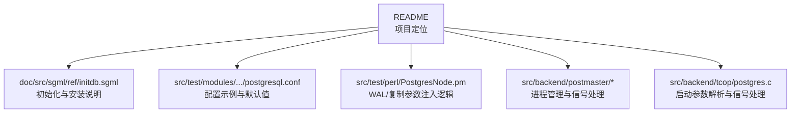
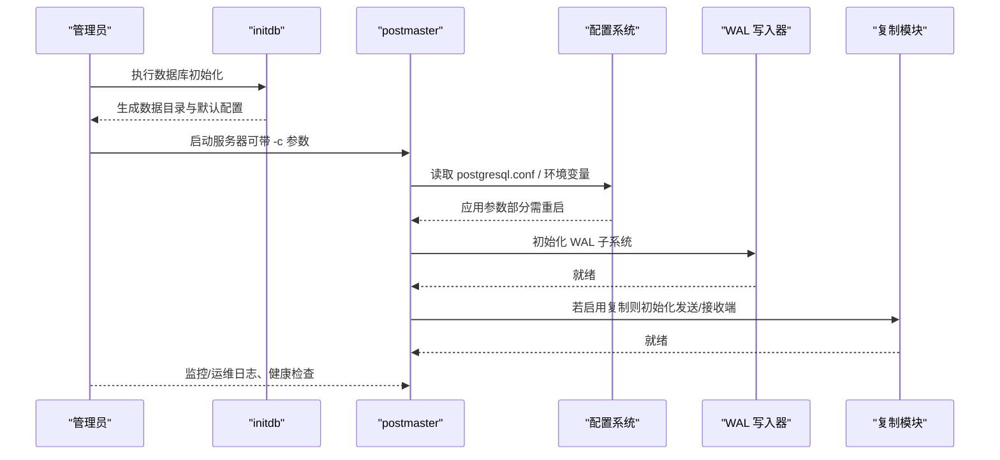
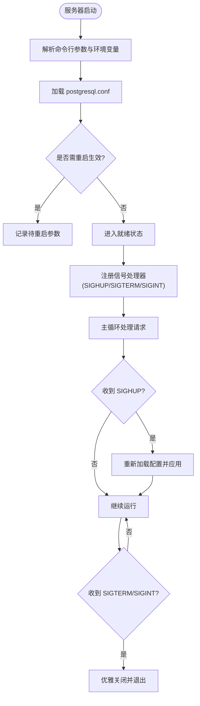
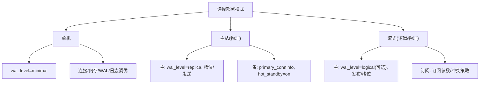
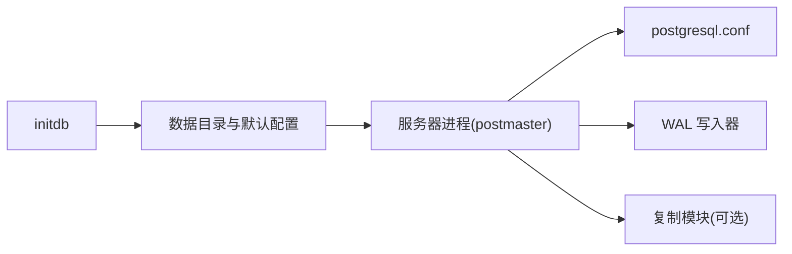

# 生产环境部署

<cite>
**本文引用的文件**
- [README](file://README)
- [postgresql.conf（测试数据目录）](file://src/test/modules/snapshot_too_old/tmp_check_iso/data/postgresql.conf)
- [PostgresNode.pm](file://src/test/perl/PostgresNode.pm)
- [initdb.sgml](file://doc/src/sgml/ref/initdb.sgml)
- [standalone-install.xml](file://doc/src/sgml/standalone-install.xml)
- [walwriter.c](file://src/backend/postmaster/walwriter.c)
- [interrupt.c](file://src/backend/postmaster/interrupt.c)
- [postgres.c](file://src/backend/tcop/postgres.c)
</cite>

## 目录
1. [简介](#简介)
2. [项目结构](#项目结构)
3. [核心组件](#核心组件)
4. [架构总览](#架构总览)
5. [详细组件分析](#详细组件分析)
6. [依赖关系分析](#依赖关系分析)
7. [性能考量](#性能考量)
8. [故障排查指南](#故障排查指南)
9. [结论](#结论)
10. [附录](#附录)

## 简介
本指南面向在生产环境中部署基于 PostgreSQL 的 Mini PostgreSQL（minipg）实例，覆盖数据库初始化、服务器启动参数与进程管理；详细说明关键配置项（内存、连接数、WAL、复制等）；提供单机、主从复制、流式复制的部署方法；并给出容器化与云平台部署的最佳实践与安全加固建议。文档内容严格依据仓库内源码与文档进行提炼与组织，便于读者快速落地生产。

## 项目结构
- 本项目为裁剪后的 PostgreSQL 内核实现，保留核心功能以利于学习与轻量部署。
- 配置文件示例与行为参考位于测试数据目录中的 postgresql.conf，以及 Perl 测试框架 PostgresNode.pm 中对 WAL/复制相关参数的动态设置。
- 初始化与安装说明由 doc 目录下的 SGML 文档提供，包括 initdb 的行为与注意事项。
- 后端进程信号处理、配置热重载、WAL 写入器等核心流程在 backend 目录中实现。

**图表来源**
- [README:1-6](file://README#L1-L6)
- [initdb.sgml:68-93](file://doc/src/sgml/ref/initdb.sgml#L68-L93)
- [postgresql.conf（测试数据目录）:55-131](file://src/test/modules/snapshot_too_old/tmp_check_iso/data/postgresql.conf#L55-L131)
- [PostgresNode.pm:515-596](file://src/test/perl/PostgresNode.pm#L515-L596)
- [walwriter.c:98-127](file://src/backend/postmaster/walwriter.c#L98-L127)
- [postgres.c:4012-4052](file://src/backend/tcop/postgres.c#L4012-L4052)

**章节来源**
- [README:1-6](file://README#L1-L6)

## 核心组件
- 数据库初始化：使用 initdb 创建集群，注意运行用户权限、字符集与区域设置、安全默认访问控制等。
- 服务器启动与参数：通过命令行选项或配置文件加载参数，支持运行时热重载与重启生效的参数分类。
- 进程管理与信号：postmaster 与子进程的信号处理、配置重载、优雅退出与崩溃恢复。
- WAL 与复制：根据部署模式设置 wal_level、max_wal_size/min_wal_size、hot_standby、primary_conninfo 等。

**章节来源**
- [initdb.sgml:68-93](file://doc/src/sgml/ref/initdb.sgml#L68-L93)
- [standalone-install.xml:135-171](file://doc/src/sgml/standalone-install.xml#L135-L171)
- [postgresql.conf（测试数据目录）:55-131](file://src/test/modules/snapshot_too_old/tmp_check_iso/data/postgresql.conf#L55-L131)
- [PostgresNode.pm:515-596](file://src/test/perl/PostgresNode.pm#L515-L596)

## 架构总览
下图展示生产部署的关键阶段与组件交互：初始化 → 启动 → 配置加载 → WAL/复制 → 进程管理。

**图表来源**
- [initdb.sgml:68-93](file://doc/src/sgml/ref/initdb.sgml#L68-L93)
- [postgresql.conf（测试数据目录）:55-131](file://src/test/modules/snapshot_too_old/tmp_check_iso/data/postgresql.conf#L55-L131)
- [walwriter.c:98-127](file://src/backend/postmaster/walwriter.c#L98-L127)
- [PostgresNode.pm:515-596](file://src/test/perl/PostgresNode.pm#L515-L596)

## 详细组件分析

### 数据库初始化与集群准备
- 运行用户与权限：initdb 必须以非 root 的用户运行，该用户将拥有数据目录与后续服务进程的文件访问权限。
- 区域与编码：初始化时确定默认 locale 与字符集，影响排序规则与模板库设置。
- 安全默认：新集群默认仅对集群所有者可见，可通过特定选项放宽组访问以便备份等非特权操作。
- 安装后建议：默认配置偏向最小硬件，生产需调整共享缓冲与工作内存等关键参数以获得最佳性能。

**章节来源**
- [initdb.sgml:68-93](file://doc/src/sgml/ref/initdb.sgml#L68-L93)
- [standalone-install.xml:135-171](file://doc/src/sgml/standalone-install.xml#L135-L171)

### 服务器启动参数与进程管理
- 启动参数来源：命令行 -c 选项、配置文件、环境变量；部分参数需重启生效。
- 信号与热重载：SIGHUP 触发配置重载；SIGTERM/SIGINT 触发优雅关闭；后台进程注册相应信号处理器。
- 进程模型：postmaster 负责管理后端进程与 WAL 写入器等子进程；子进程在错误恢复中具备独立内存上下文以避免泄漏。

**图表来源**
- [postgres.c:4012-4052](file://src/backend/tcop/postgres.c#L4012-L4052)
- [interrupt.c:26-61](file://src/backend/postmaster/interrupt.c#L26-L61)
- [walwriter.c:98-127](file://src/backend/postmaster/walwriter.c#L98-L127)

**章节来源**
- [postgres.c:4012-4052](file://src/backend/tcop/postgres.c#L4012-L4052)
- [interrupt.c:26-61](file://src/backend/postmaster/interrupt.c#L26-L61)
- [walwriter.c:98-127](file://src/backend/postmaster/walwriter.c#L98-L127)

### PostgreSQL 配置文件关键参数（生产导向）
- 连接与认证
  - listen_addresses、port：监听地址与端口，生产通常绑定到内网或受控网络。
  - max_connections：最大并发连接数，需结合工作负载与资源评估。
  - superuser_reserved_connections：预留超级用户连接，避免耗尽。
  - unix_socket_directories、unix_socket_group、unix_socket_permissions：本地套接字安全与访问控制。
  - authentication_timeout、password_encryption：认证超时与密码加密策略（推荐强加密）。
- 内存与资源
  - shared_buffers：共享缓冲区大小，生产需按内存规模调优。
  - work_mem、maintenance_work_mem：查询与维护任务的工作内存。
  - dynamic_shared_memory_type：动态共享内存类型（如 posix），确保与操作系统兼容。
  - temp_file_limit、max_files_per_process：限制临时文件与每进程文件句柄。
- WAL 与持久化
  - wal_level：minimal/replica/logical，根据是否需要归档/复制/逻辑解码选择。
  - fsync、synchronous_commit：崩溃安全与同步提交级别，生产建议开启 fsync 并根据一致性需求设置同步级别。
  - full_page_writes、wal_log_hints：提升恢复能力与诊断信息。
  - wal_compression、wal_init_zero、wal_recycle：压缩与空间回收策略。
  - checkpoint_timeout、checkpoint_completion_target、max_wal_size、min_wal_size：检查点与 WAL 大小管理。
- 复制与高可用
  - primary_conninfo、primary_slot_name：备库连接主库信息与槽位。
  - hot_standby、max_standby_archive/streaming_delay：备库读与延迟控制。
  - wal_receiver_*：接收端超时与重试间隔。
- 日志与可观测性
  - logging_collector、log_directory、log_filename、log_rotation_age/size：日志收集与轮转。
  - log_min_messages、log_statement、log_duration：日志级别与语句/时长采集。
  - log_line_prefix：统一日志前缀便于追踪。
- 其他
  - timezone、datestyle、lc_*：时区与区域格式。
  - autovacuum_*：自动清理策略，生产建议按需调整。

以上参数在仓库测试配置中有明确示例与注释，可作为生产基线参考。

**章节来源**
- [postgresql.conf（测试数据目录）:55-131](file://src/test/modules/snapshot_too_old/tmp_check_iso/data/postgresql.conf#L55-L131)
- [postgresql.conf（测试数据目录）:173-216](file://src/test/modules/snapshot_too_old/tmp_check_iso/data/postgresql.conf#L173-L216)
- [postgresql.conf（测试数据目录）:253-304](file://src/test/modules/snapshot_too_old/tmp_check_iso/data/postgresql.conf#L253-L304)
- [postgresql.conf（测试数据目录）:362-512](file://src/test/modules/snapshot_too_old/tmp_check_iso/data/postgresql.conf#L362-L512)

### 不同部署模式的配置方法
- 单机模式
  - 设置 wal_level=minimal（无需复制/归档），关闭复制相关参数。
  - 合理配置 shared_buffers、work_mem、max_connections、WAL 大小与检查点。
  - 启用日志收集与轮转，设置合适的时区与区域。
- 主从复制（物理复制）
  - 主库：wal_level=replica，启用必要的 WAL 参数与槽位管理。
  - 备库：设置 primary_conninfo、primary_slot_name、hot_standby=on，调整延迟与反馈参数。
  - 通过 PostgresNode.pm 的逻辑可知，允许流式复制时会设置 wal_level、wal_log_hints、hot_standby 等。
- 流式复制（含逻辑复制）
  - 主库：wal_level=logical（如需逻辑解码），配置逻辑复制槽与发布。
  - 备库/订阅方：根据订阅需求配置订阅参数与冲突处理。
  - 测试框架中当 allows_streaming='logical' 时，会设置 wal_level=logical 并开启相关提示与热备参数。

**图表来源**
- [PostgresNode.pm:515-596](file://src/test/perl/PostgresNode.pm#L515-L596)
- [postgresql.conf（测试数据目录）:173-216](file://src/test/modules/snapshot_too_old/tmp_check_iso/data/postgresql.conf#L173-L216)
- [postgresql.conf（测试数据目录）:253-304](file://src/test/modules/snapshot_too_old/tmp_check_iso/data/postgresql.conf#L253-L304)

**章节来源**
- [PostgresNode.pm:515-596](file://src/test/perl/PostgresNode.pm#L515-L596)
- [postgresql.conf（测试数据目录）:173-216](file://src/test/modules/snapshot_too_old/tmp_check_iso/data/postgresql.conf#L173-L216)
- [postgresql.conf（测试数据目录）:253-304](file://src/test/modules/snapshot_too_old/tmp_check_iso/data/postgresql.conf#L253-L304)

### 容器化部署方案
- 镜像与数据卷
  - 使用官方或自构建镜像，将数据目录挂载至持久卷，确保重启不丢失。
  - 通过环境变量或 ConfigMap/Secret 注入 postgresql.conf 片段与敏感信息（如密码）。
- 启动参数与配置
  - 通过 -c 或配置文件设置关键参数（shared_buffers、max_connections、WAL、日志等）。
  - 利用 include_dir/include_if_exists/include 机制拆分配置，便于多环境管理。
- 健康检查与探针
  - 暴露健康检查接口或使用 psql 探测可用性，配合编排平台进行存活与就绪探针。
- 日志与监控
  - 启用日志收集器并将日志输出到标准输出或外部存储，便于集中采集。
  - 暴露统计指标（如 pg_stat_*）供监控系统抓取。

[本节为通用实践指导，未直接分析具体文件]

### 云平台部署最佳实践
- 网络与安全
  - 将数据库置于私有子网，仅允许应用层访问；使用安全组/防火墙限制源 IP。
  - 启用 TLS 加密传输与强密码加密策略（如 scram-sha-256）。
- 高可用与备份
  - 采用主从或多副本架构，配置同步/异步复制以满足 RPO/RTO。
  - 定期全量与增量备份，结合 WAL 归档实现时间点恢复。
- 容量与弹性
  - 根据负载曲线调整 CPU/内存/磁盘规格；对 I/O 密集型场景选择高性能存储。
  - 使用只读副本分担查询压力，提升吞吐与可用性。
- 可观测性与告警
  - 采集慢查询、锁等待、WAL 增长、连接数等关键指标，设置阈值告警。
  - 统一日志格式与时间戳，便于跨系统关联分析。

[本节为通用实践指导，未直接分析具体文件]

### 安全加固配置与网络访问控制
- 认证与授权
  - 启用强密码加密策略；限制认证超时；谨慎授予超级用户权限。
  - 使用角色与权限最小化原则分配访问范围。
- 网络访问控制
  - 仅监听必要地址与端口；使用 Unix Socket 限制本地访问；配置 socket 权限与组。
  - 结合防火墙/安全组限制客户端来源。
- 审计与日志
  - 开启连接/断开日志、语句日志（按需）、慢查询日志；统一日志前缀便于追踪。
  - 定期轮转与归档日志，保护敏感信息。
- 数据安全
  - 启用 WAL 压缩与完整页写；合理设置 fsync 与同步提交级别保障一致性。
  - 定期备份与演练恢复流程。

**章节来源**
- [postgresql.conf（测试数据目录）:55-131](file://src/test/modules/snapshot_too_old/tmp_check_iso/data/postgresql.conf#L55-L131)
- [postgresql.conf（测试数据目录）:362-512](file://src/test/modules/snapshot_too_old/tmp_check_iso/data/postgresql.conf#L362-L512)

## 依赖关系分析
- 初始化依赖：initdb 负责创建数据目录与默认配置，后续服务器启动依赖其产物。
- 配置依赖：服务器启动时加载 postgresql.conf，部分参数需重启生效；支持热重载。
- 进程依赖：postmaster 管理后端进程与 WAL 写入器；子进程通过信号与 latch 协调。
- 复制依赖：根据 wal_level 与相关参数决定是否启用复制模块及发送/接收端。

**图表来源**
- [initdb.sgml:68-93](file://doc/src/sgml/ref/initdb.sgml#L68-L93)
- [postgresql.conf（测试数据目录）:55-131](file://src/test/modules/snapshot_too_old/tmp_check_iso/data/postgresql.conf#L55-L131)
- [walwriter.c:98-127](file://src/backend/postmaster/walwriter.c#L98-L127)
- [PostgresNode.pm:515-596](file://src/test/perl/PostgresNode.pm#L515-L596)

**章节来源**
- [initdb.sgml:68-93](file://doc/src/sgml/ref/initdb.sgml#L68-L93)
- [postgresql.conf（测试数据目录）:55-131](file://src/test/modules/snapshot_too_old/tmp_check_iso/data/postgresql.conf#L55-L131)
- [walwriter.c:98-127](file://src/backend/postmaster/walwriter.c#L98-L127)
- [PostgresNode.pm:515-596](file://src/test/perl/PostgresNode.pm#L515-L596)

## 性能考量
- 内存调优：shared_buffers、work_mem、maintenance_work_mem 需根据内存规模与负载特征调整；避免过度分配导致交换。
- I/O 与 WAL：合理设置 max_wal_size/min_wal_size、checkpoint 目标与 flush 策略，平衡写入吞吐与恢复时间。
- 并行与后台任务：max_worker_processes、autovacuum 参数需与 CPU/IO 能力匹配，避免争用。
- 日志开销：生产建议启用日志收集器与轮转，但避免过高的语句/采样日志率影响性能。

[本节为通用性能指导，未直接分析具体文件]

## 故障排查指南
- 启动失败
  - 检查 initdb 是否成功、数据目录权限是否正确、配置文件语法与参数合法性。
  - 查看日志目录与轮转文件，定位错误原因。
- 配置未生效
  - 确认参数是否需重启生效；使用 SIGHUP/pg_ctl reload 或 SQL 函数进行热重载。
- 复制异常
  - 检查 wal_level、primary_conninfo、槽位是否存在；观察 WAL 接收日志与重试间隔。
- 进程崩溃与恢复
  - postmaster 与子进程的信号处理确保崩溃后可恢复；必要时清理临时文件并重启。

**章节来源**
- [postgres.c:4012-4052](file://src/backend/tcop/postgres.c#L4012-L4052)
- [interrupt.c:26-61](file://src/backend/postmaster/interrupt.c#L26-L61)
- [walwriter.c:98-127](file://src/backend/postmaster/walwriter.c#L98-L127)

## 结论
本指南基于仓库内的配置示例、初始化文档与后端实现，提供了生产环境部署的最小可行路径与扩展方向。通过合理的初始化、参数调优、进程管理与复制配置，可在单机或高可用场景中稳定运行。容器化与云平台部署应结合网络隔离、安全加固与可观测性建设，确保业务连续性与可维护性。

## 附录
- 常用命令参考
  - 初始化：initdb（注意运行用户与权限）
  - 启动/停止：pg_ctl（支持多种停止模式）
  - 配置重载：SIGHUP 或 pg_ctl reload
  - 连接工具：psql（用于验证与调试）
- 参考文件
  - 初始化与安装说明：initdb.sgml、standalone-install.xml
  - 配置示例：postgresql.conf（测试数据目录）
  - 复制参数注入：PostgresNode.pm
  - 进程与信号：interrupt.c、walwriter.c、postgres.c

[本节为补充信息，未直接分析具体文件]