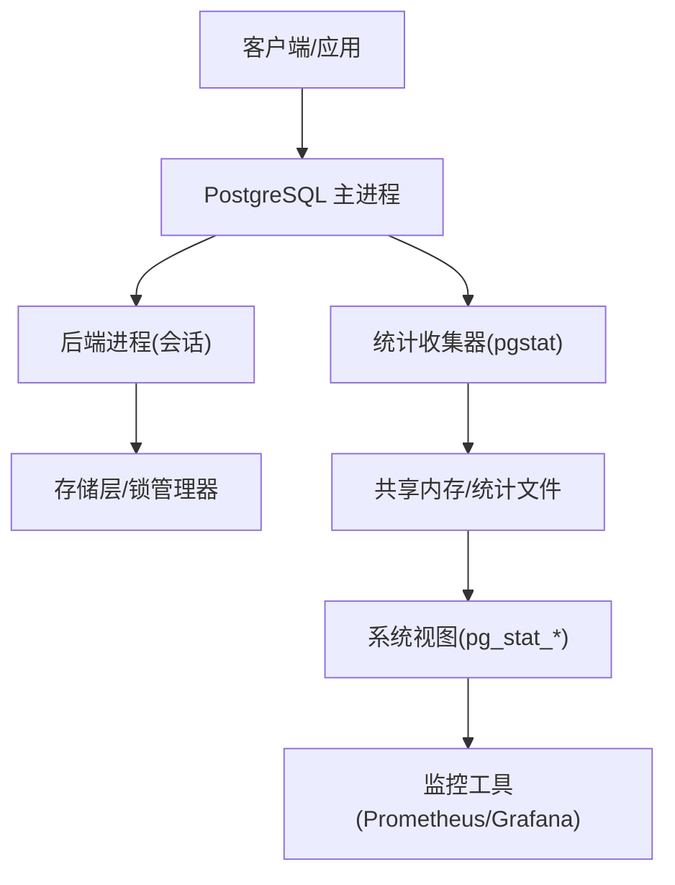
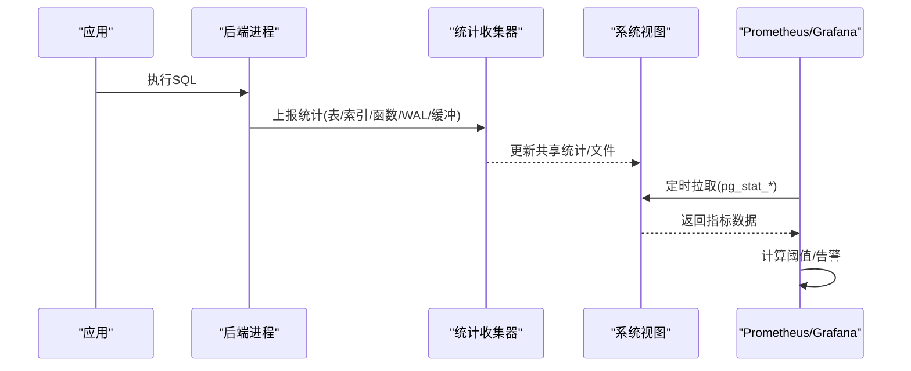

# 监控告警

<cite>
**本文引用的文件**
- [monitoring.sgml](file://doc/src/sgml/monitoring.sgml)
- [pgstat.c](file://src/backend/postmaster/pgstat.c)
- [pgstatfuncs.c](file://src/backend/utils/adt/pgstatfuncs.c)
- [system_views.sql](file://src/backend/catalog/system_views.sql)
- [config.sgml](file://doc/src/sgml/config.sgml)
- [postgres.c](file://src/backend/tcop/postgres.c)
- [deadlock.c](file://src/backend/storage/lmgr/deadlock.c)
- [proc.c](file://src/backend/storage/lmgr/proc.c)
- [postmaster.c](file://src/backend/postmaster/postmaster.c)
</cite>

## 目录
1. [简介](#简介)
2. [项目结构](#项目结构)
3. [核心组件](#核心组件)
4. [架构总览](#架构总览)
5. [详细组件分析](#详细组件分析)
6. [依赖关系分析](#依赖关系分析)
7. [性能考量](#性能考量)
8. [故障排查指南](#故障排查指南)
9. [结论](#结论)
10. [附录](#附录)

## 简介
本指南面向PostgreSQL实例的监控与告警实践，覆盖以下主题：
- 内置监控指标的采集与展示：重点说明 pg_stat_* 系列视图的使用方法与关键指标含义。
- 外部监控工具集成方案：提供与Prometheus、Grafana等工具的对接思路与落地步骤。
- 关键性能指标阈值与告警规则：给出常见KPI的建议阈值与告警策略。
- 慢查询分析、锁等待监控、连接池监控：提供可操作的实现方法。
- 日志分析与错误追踪最佳实践：基于服务器日志与采样机制，构建可观测性闭环。

## 项目结构
围绕监控与告警，代码库中涉及的关键位置包括：
- 文档与配置：监控章节与运行时配置参数定义。
- 统计收集器：后台进程负责汇总后端活动、表/索引访问、函数调用、WAL与缓冲等统计信息。
- 系统视图：将统计信息以SQL视图形式暴露给上层应用与监控工具。
- 锁与死锁检测：记录锁等待与死锁事件，便于告警与排障。
- 连接管理：控制最大连接数与子进程数量，支撑连接池监控。

图表来源
- [pgstat.c:71-105](file://src/backend/postmaster/pgstat.c#L71-L105)
- [system_views.sql:490-546](file://src/backend/catalog/system_views.sql#L490-L546)

章节来源
- [monitoring.sgml:132-200](file://doc/src/sgml/monitoring.sgml#L132-L200)
- [pgstat.c:71-105](file://src/backend/postmaster/pgstat.c#L71-L105)

## 核心组件
- 统计收集器（pgstat）：负责从各后端进程收集并聚合统计数据，支持表/索引访问计数、函数调用次数与耗时、WAL与缓冲统计、SLRU统计等。
- 系统视图（pg_stat_*）：将统计信息以标准SQL视图暴露，如 pg_stat_database、pg_stat_user_tables、pg_stat_activity 等，供查询与导出。
- 日志与采样：通过 log_min_duration_statement/log_min_duration_sample/log_statement_sample_rate 等参数控制语句时长日志与采样。
- 锁与死锁：在锁等待与死锁检测时输出详细日志，辅助定位阻塞链与冲突点。
- 连接池监控：通过 max_connections 与后端进程计数，结合 pg_stat_activity 观察连接使用率与空闲会话。

章节来源
- [pgstat.c:112-163](file://src/backend/postmaster/pgstat.c#L112-L163)
- [system_views.sql:323-546](file://src/backend/catalog/system_views.sql#L323-L546)
- [config.sgml:5642-5783](file://doc/src/sgml/config.sgml#L5642-L5783)
- [deadlock.c:1085-1130](file://src/backend/storage/lmgr/deadlock.c#L1085-L1130)
- [postmaster.c:1912-1943](file://src/backend/postmaster/postmaster.c#L1912-L1943)

## 架构总览
下图展示了从后端活动到统计视图再到外部监控工具的完整链路：

图表来源
- [pgstat.c:71-105](file://src/backend/postmaster/pgstat.c#L71-L105)
- [system_views.sql:490-546](file://src/backend/catalog/system_views.sql#L490-L546)

## 详细组件分析

### 内置监控指标与 pg_stat_* 视图
- 数据库级指标：pg_stat_database 提供提交/回滚事务数、块命中/读取、元组操作、临时文件/字节、死锁、校验失败、读写耗时、会话时间/活跃时间/空闲事务时间等。
- 表/索引级指标：pg_stat_all_tables/pg_stat_user_tables 提供顺序扫描、索引扫描、元组插入/更新/删除/HOT更新等；pg_stat_all_indexes/pg_stat_user_indexes 提供索引扫描与返回/获取元组数。
- 函数调用指标：pg_stat_user_functions 提供函数调用次数与总耗时/自耗时。
- 实时活动：pg_stat_activity 显示当前会话状态、等待事件、执行的命令等，用于发现慢查询与阻塞。

建议用法：
- 定期采集 pg_stat_database 与 pg_stat_user_tables 作为基础KPI。
- 使用 pg_stat_activity 进行实时诊断，关注 waiting/wait_event 字段。
- 对热点表/索引建立基线，设置环比/同比告警。

章节来源
- [system_views.sql:323-546](file://src/backend/catalog/system_views.sql#L323-L546)
- [monitoring.sgml:267-297](file://doc/src/sgml/monitoring.sgml#L267-L297)

### 统计收集器与指标采集
- 收集器启动与轮询：最小更新间隔、重试延迟、最大等待时间等常量定义了统计文件的刷新节奏。
- 哈希表初始大小：数据库、表、函数、复制槽的哈希表规模影响扩展性与内存占用。
- 全局统计：BgWriterStats、WalStats 直接存储在消息结构中，减少拷贝开销。
- SLRU统计：维护固定列表的SLRU名称，按类别累计统计。

优化建议：
- 根据负载调整统计文件刷新间隔，避免过高频率导致I/O压力。
- 合理设置哈希表初始大小，降低扩容成本。
- 在高吞吐场景下，谨慎开启函数调用统计，评估额外开销。

章节来源
- [pgstat.c:71-105](file://src/backend/postmaster/pgstat.c#L71-L105)
- [pgstat.c:112-163](file://src/backend/postmaster/pgstat.c#L112-L163)

### 慢查询分析与日志采样
- log_min_duration_statement：超过阈值的语句会记录时长，适合定位慢查询。
- log_min_duration_sample：对超过阈值的语句进行采样记录，降低高流量下的日志量。
- log_statement_sample_rate：控制采样比例，平衡日志量与覆盖率。
- 检查逻辑：tcop 层在执行完成后判断是否需要记录时长，并结合采样与事务采样策略。

实践建议：
- 生产环境建议启用 log_min_duration_statement，阈值依据业务SLA设定（例如200ms~500ms）。
- 高并发场景配合 log_min_duration_sample 与采样率，避免日志风暴。
- 结合 EXPLAIN/EXPLAIN ANALYZE 深入分析慢查询计划。

章节来源
- [config.sgml:5642-5783](file://doc/src/sgml/config.sgml#L5642-L5783)
- [postgres.c:2285-2335](file://src/backend/tcop/postgres.c#L2285-L2335)

### 锁等待监控与死锁告警
- 等待事件：pg_stat_activity 中的 wait_event 类型包含 Lock、Timeout、Activity 等，可用于识别阻塞与超时。
- 死锁检测：当检测到死锁循环时，生成详细日志，包含“等待谁”、“被谁阻塞”等信息。
- 长时间等待日志：在锁等待过程中，若等待时间过长，会输出LOG级别日志，包含持有者与等待队列详情。

告警策略：
- 对 pg_locks 中长时间持有的锁或等待队列长度设置阈值告警。
- 对死锁事件立即触发告警，并附带阻塞链信息。
- 结合 wait_event 分类，针对 LWLock、Timeout 等类型设置差异化阈值。

章节来源
- [monitoring.sgml:1027-1047](file://doc/src/sgml/monitoring.sgml#L1027-L1047)
- [monitoring.sgml:1827-1841](file://doc/src/sgml/monitoring.sgml#L1827-L1841)
- [monitoring.sgml:1843-1850](file://doc/src/sgml/monitoring.sgml#L1843-L1850)
- [monitoring.sgml:2174-2183](file://doc/src/sgml/monitoring.sgml#L2174-L2183)
- [monitoring.sgml:2185-2193](file://doc/src/sgml/monitoring.sgml#L2185-L2193)
- [deadlock.c:1085-1130](file://src/backend/storage/lmgr/deadlock.c#L1085-L1130)
- [proc.c:1597-1628](file://src/backend/storage/lmgr/proc.c#L1597-L1628)

### 连接池监控
- 最大连接限制：postmaster 在创建新连接前检查子进程数量是否超过 MaxLivePostmasterChildren()，防止过载。
- 连接状态：通过 pg_stat_activity 观察当前连接数、空闲会话、长事务等。
- 告警建议：
  - 连接使用率超过阈值（如80%）时告警，提示扩容或优化连接池。
  - 空闲会话过多可能意味着连接泄漏，需结合应用侧排查。
  - 长事务与长时间等待的连接应纳入告警范围。

章节来源
- [postmaster.c:1912-1943](file://src/backend/postmaster/postmaster.c#L1912-L1943)

### 外部监控工具集成（Prometheus/Grafana）
- 指标采集：通过定时查询 pg_stat_* 视图，将关键指标导出为时序数据。
- 采集方式：
  - 使用 PostgreSQL Exporter（官方或社区实现）自动暴露 pg_stat_* 指标。
  - 或使用自定义脚本/ETL工具定期抓取并写入时序数据库。
- 可视化与告警：
  - Grafana 中创建仪表盘，展示数据库级与表级指标。
  - 基于 Prometheus 规则引擎设置阈值告警（如连接数、慢查询、死锁、块命中率下降等）。

实施要点：
- 确保采集账号具备必要的只读权限（如 pg_monitor 角色）。
- 控制采集频率，避免对数据库造成额外压力。
- 对敏感信息进行脱敏，遵循安全策略。

[本节为概念性内容，不直接分析具体文件]

## 依赖关系分析
统计收集器与系统视图之间的依赖关系如下：

图表来源
- [pgstat.c:71-105](file://src/backend/postmaster/pgstat.c#L71-L105)
- [pgstatfuncs.c:333-399](file://src/backend/utils/adt/pgstatfuncs.c#L333-L399)
- [system_views.sql:490-546](file://src/backend/catalog/system_views.sql#L490-L546)

章节来源
- [pgstat.c:71-105](file://src/backend/postmaster/pgstat.c#L71-L105)
- [pgstatfuncs.c:333-399](file://src/backend/utils/adt/pgstatfuncs.c#L333-L399)
- [system_views.sql:490-546](file://src/backend/catalog/system_views.sql#L490-L546)

## 性能考量
- 统计收集开销：开启统计收集会增加执行路径上的开销，应根据负载权衡开关与粒度。
- 日志采样：在高QPS环境下，优先使用 log_min_duration_sample 与采样率控制日志量。
- 视图查询频率：避免高频查询 pg_stat_* 视图，必要时缓存或降采样。
- 锁等待与死锁：频繁的死锁与长等待会影响整体吞吐，需及时优化SQL与索引。

[本节提供一般性指导，不直接分析具体文件]

## 故障排查指南
- 慢查询定位：启用 log_min_duration_statement，结合 EXPLAIN/EXPLAIN ANALYZE 分析执行计划。
- 锁等待排查：查看 pg_stat_activity.wait_event 与 pg_locks，识别阻塞链与持有者。
- 死锁处理：根据死锁日志中的“等待谁/被谁阻塞”信息，快速定位冲突点。
- 连接池问题：监控连接使用率与空闲会话，排查连接泄漏与长事务。
- 指标异常：对比历史基线，关注块命中率、临时文件增长、WAL写入耗时等。

章节来源
- [config.sgml:5642-5783](file://doc/src/sgml/config.sgml#L5642-L5783)
- [deadlock.c:1085-1130](file://src/backend/storage/lmgr/deadlock.c#L1085-L1130)
- [proc.c:1597-1628](file://src/backend/storage/lmgr/proc.c#L1597-L1628)

## 结论
通过内置统计收集器与系统视图，PostgreSQL提供了丰富的监控能力。结合日志采样与锁/死锁检测，可以构建完整的可观测性体系。在生产环境中，建议：
- 启用必要的统计与日志采样，设定合理的阈值。
- 集成Prometheus/Grafana，实现自动化采集、可视化与告警。
- 持续优化慢查询与锁竞争，保障系统稳定性与性能。

[本节为总结性内容，不直接分析具体文件]

## 附录

### 关键指标与阈值建议
- 连接使用率：>80% 告警，>95% 严重告警。
- 块命中率：<95% 告警，<90% 严重告警。
- 慢查询比例：>5% 告警，>10% 严重告警。
- 死锁次数：>0 立即告警。
- 临时文件增长：环比突增告警。

[本节为概念性内容，不直接分析具体文件]

### 常用视图与查询示例（路径引用）
- 数据库级指标：pg_stat_database
  - 参考路径：[system_views.sql:490-524](file://src/backend/catalog/system_views.sql#L490-L524)
- 用户表指标：pg_stat_user_tables
  - 参考路径：[system_views.sql:353-356](file://src/backend/catalog/system_views.sql#L353-L356)
- 用户函数指标：pg_stat_user_functions
  - 参考路径：[system_views.sql:536-546](file://src/backend/catalog/system_views.sql#L536-L546)

章节来源
- [system_views.sql:353-356](file://src/backend/catalog/system_views.sql#L353-L356)
- [system_views.sql:490-524](file://src/backend/catalog/system_views.sql#L490-L524)
- [system_views.sql:536-546](file://src/backend/catalog/system_views.sql#L536-L546)