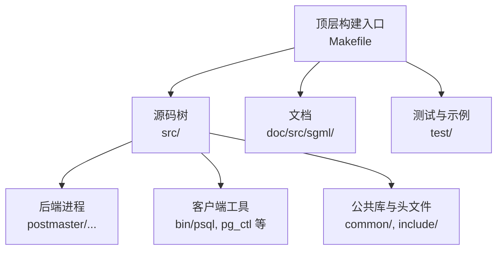
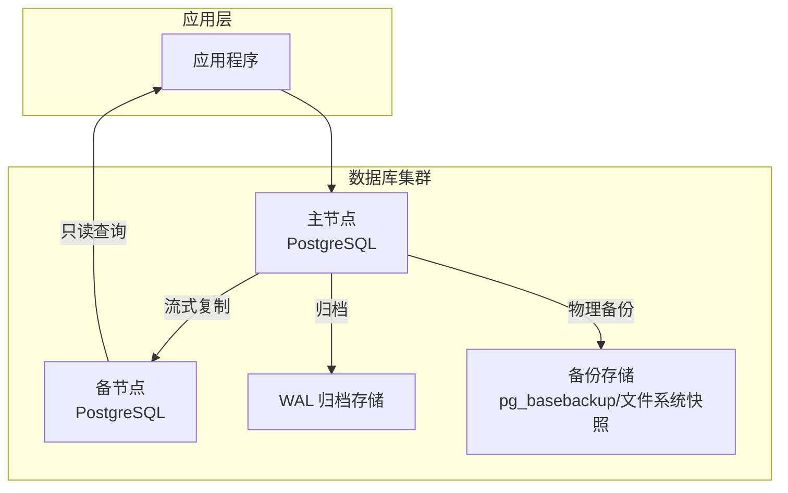
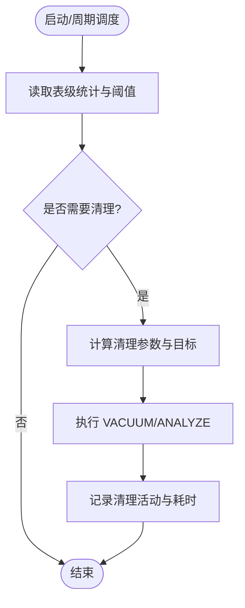
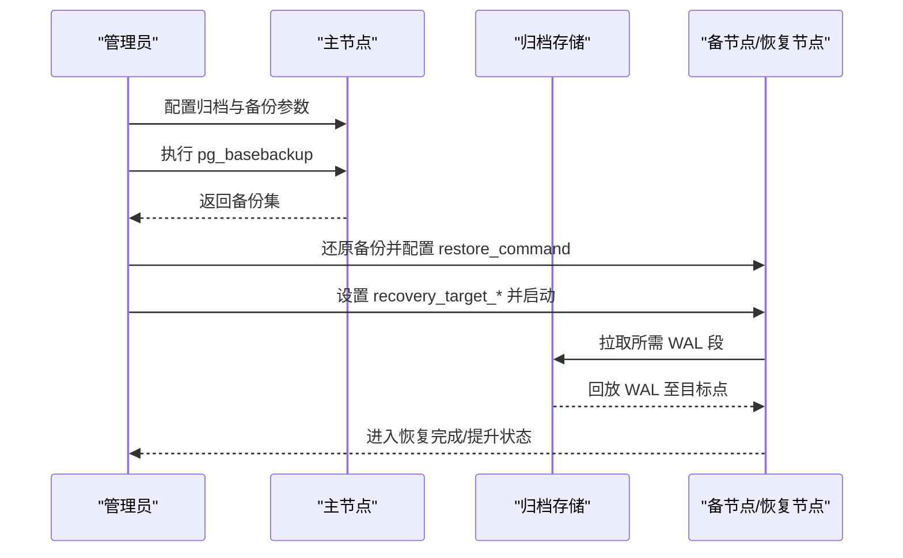
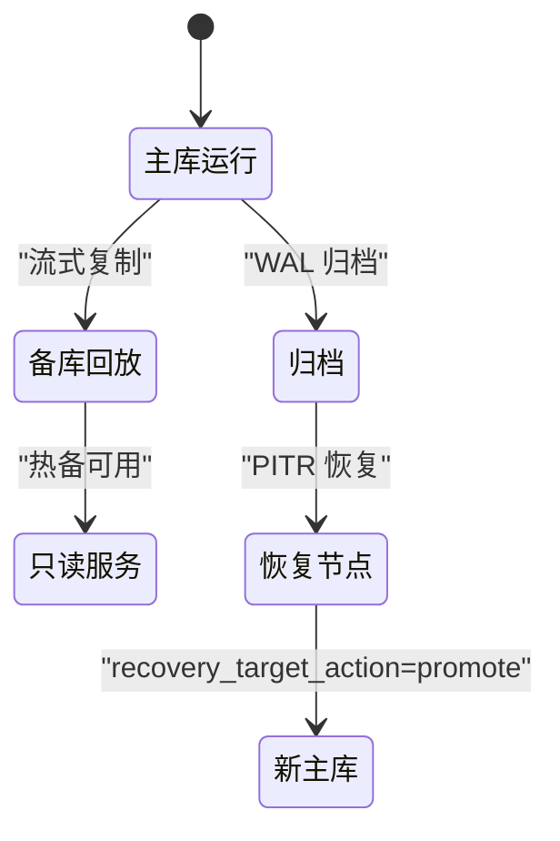
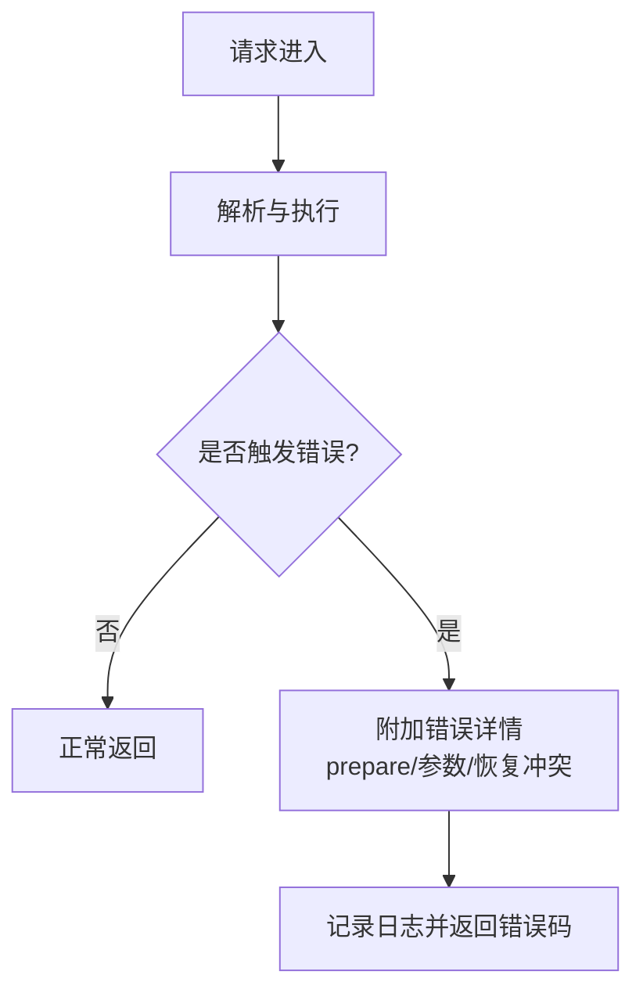
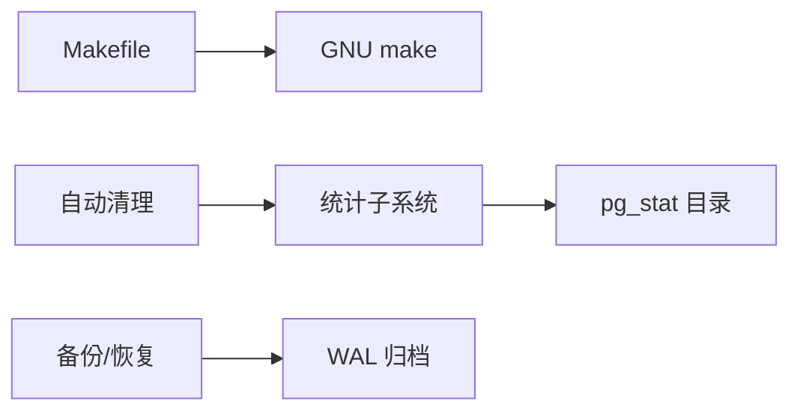

# 部署和运维

<cite>
**本文引用的文件**
- [README](file://README)
- [Makefile](file://Makefile)
- [postgresql.conf（测试示例）](file://src/test/modules/snapshot_too_old/tmp_check_iso/data/postgresql.conf)
- [pgstat.h](file://src/include/pgstat.h)
- [autovacuum.c](file://src/backend/postmaster/autovacuum.c)
- [postgres.c](file://src/backend/tcop/postgres.c)
- [pqmq.c](file://src/backend/libpq/pqmq.c)
- [PostgresNode.pm](file://src/test/perl/PostgresNode.pm)
- [maintenance.sgml](file://doc/src/sgml/maintenance.sgml)
- [problems.sgml](file://doc/src/sgml/problems.sgml)
- [standalone-install.xml](file://doc/src/sgml/standalone-install.xml)
- [diskusage.sgml](file://doc/src/sgml/diskusage.sgml)
- [bgworker.sgml](file://doc/src/sgml/bgworker.sgml)
- [initdb.sgml](file://doc/src/sgml/ref/initdb.sgml)
</cite>

## 目录
1. [简介](#简介)
2. [项目结构](#项目结构)
3. [核心组件](#核心组件)
4. [架构总览](#架构总览)
5. [详细组件分析](#详细组件分析)
6. [依赖关系分析](#依赖关系分析)
7. [性能考虑](#性能考虑)
8. [故障排除指南](#故障排除指南)
9. [结论](#结论)
10. [附录](#附录)

## 简介
本指南面向生产环境的部署与运维，覆盖配置、性能调优、监控、高可用与备份恢复、日常维护、容量规划与安全加固等主题。本项目为基于 PostgreSQL 的轻量级数据库实现（Mini PostgreSQL），其核心行为与运维实践与主流 PostgreSQL 高度一致，因此可沿用成熟的部署与运维方法论，并结合仓库中的配置文件、统计接口与工具脚本进行落地。

## 项目结构
- 源码与构建：顶层 Makefile 负责引导 GNU make；configure.ac 用于生成构建配置；src 下包含后端、前端工具、公共库与头文件。
- 文档：doc/src/sgml 提供安装、维护、监控、问题排查等官方文档素材。
- 测试与示例：test 目录下包含回归测试、Perl 测试框架与示例配置，可用于演练备份恢复与 PITR 流程。
- 扩展：contrib 提供常用扩展模块（如 pageinspect、pg_statistic 相关能力）。

**章节来源**
- [Makefile:1-42](file://Makefile#L1-L42)
- [README:1-6](file://README#L1-L6)

## 核心组件
- 服务器进程与后台任务：主进程负责监听连接、派生子进程处理会话；后台任务包括检查点、WAL 写入、自动清理（autovacuum）、日志收集器等。
- 配置系统：通过 postgresql.conf 集中管理运行时参数，支持热重载与重启生效两类参数。
- 统计与监控：内置统计采集器输出到 pg_stat_* 视图，便于观测查询、I/O、锁等待、复制状态等。
- 备份与恢复：支持逻辑备份、物理备份（pg_basebackup）、归档与时间点恢复（PITR）。
- 安全与认证：通过 initdb 初始化时设置默认认证方式，结合 pg_hba.conf 控制访问策略。

**章节来源**
- [postgresql.conf（测试示例）:52-130](file://src/test/modules/snapshot_too_old/tmp_check_iso/data/postgresql.conf#L52-L130)
- [pgstat.h:27-36](file://src/include/pgstat.h#L27-L36)
- [PostgresNode.pm:650-758](file://src/test/perl/PostgresNode.pm#L650-L758)
- [initdb.sgml:117-153](file://doc/src/sgml/ref/initdb.sgml#L117-L153)

## 架构总览
下图展示生产环境典型的高可用与备份恢复架构，涵盖主从复制、归档、备份与恢复路径。

**图示来源**
- [PostgresNode.pm:650-758](file://src/test/perl/PostgresNode.pm#L650-L758)
- [postgresql.conf（测试示例）:217-300](file://src/test/modules/snapshot_too_old/tmp_check_iso/data/postgresql.conf#L217-L300)

## 详细组件分析

### 配置管理与生产基线
- 关键参数类别
  - 连接与认证：listen_addresses、port、max_connections、authentication_timeout、password_encryption。
  - 内存与资源：shared_buffers、work_mem、maintenance_work_mem、temp_buffers、effective_cache_size。
  - WAL 与持久化：wal_level、fsync、synchronous_commit、checkpoint_timeout、max_wal_size/min_wal_size。
  - 日志与审计：logging_collector、log_destination、log_rotation_age/size、log_min_duration_statement、log_lock_waits。
  - 统计与监控：track_activities、track_counts、track_io_timing、compute_query_id。
  - 自动清理：autovacuum、autovacuum_vacuum_scale_factor、autovacuum_analyze_scale_factor。
- 变更策略
  - 热重载：SIGHUP 或 SELECT pg_reload_conf() 对部分参数即时生效。
  - 重启生效：涉及共享内存、WAL、并行度等需重启的参数应纳入变更窗口。
- 建议基线
  - 生产开启 logging_collector 并启用日志轮转；合理设置 log_min_duration_statement 捕获慢查询；开启 track_io_timing 辅助 I/O 瓶颈定位。
  - 根据内存规模调整 shared_buffers 与 effective_cache_size；按工作负载设定 work_mem 与 maintenance_work_mem。
  - 将 WAL 与数据目录分离至不同磁盘，提升吞吐与可靠性。

**章节来源**
- [postgresql.conf（测试示例）:52-130](file://src/test/modules/snapshot_too_old/tmp_check_iso/data/postgresql.conf#L52-L130)
- [postgresql.conf（测试示例）:173-216](file://src/test/modules/snapshot_too_old/tmp_check_iso/data/postgresql.conf#L173-L216)
- [postgresql.conf（测试示例）:362-511](file://src/test/modules/snapshot_too_old/tmp_check_iso/data/postgresql.conf#L362-L511)
- [postgresql.conf（测试示例）:523-578](file://src/test/modules/snapshot_too_old/tmp_check_iso/data/postgresql.conf#L523-L578)

### 监控与可观测性
- 统计采集器
  - 统计文件目录与临时目录由常量定义，供外部工具读取或集成监控系统。
  - 通过 track_* 系列参数控制活动跟踪、计数、函数调用与 I/O 计时。
- 关键指标
  - 事务与 I/O：n_xact_commit/rollback、n_blocks_fetched/hit、n_temp_files/temp_bytes。
  - 锁与冲突：n_conflict_lock/snapshot/bufferpin。
  - 会话与会话时长：sessions、total_session_time、total_active_time、idle_in_xact_time。
- 告警建议
  - 磁盘使用率阈值告警（预留空间避免 WAL 写满导致 panic）。
  - 长时间运行查询与锁等待告警。
  - 复制延迟与归档堆积告警。

**章节来源**
- [pgstat.h:27-36](file://src/include/pgstat.h#L27-L36)
- [pgstat.h:719-802](file://src/include/pgstat.h#L719-L802)
- [postgresql.conf（测试示例）:523-545](file://src/test/modules/snapshot_too_old/tmp_check_iso/data/postgresql.conf#L523-L545)

### 自动清理与维护
- 自动清理机制
  - autovacuum 守护进程依据表级统计与阈值触发 VACUUM/ANALYZE，防止 XID/MultiXID 回卷与膨胀。
  - 可通过 scale_factor 与 threshold 精细控制触发时机与范围。
- 手动维护
  - 在低峰期执行 VACUUM FULL 仅在必要时使用，因其需要独占锁且耗时较长。
  - 定期 ANALYZE 更新统计信息以优化查询计划。
- 日志与可观测
  - 开启 log_autovacuum_min_duration 记录慢清理；配合统计视图评估效果。

**图示来源**
- [autovacuum.c:2724-2878](file://src/backend/postmaster/autovacuum.c#L2724-L2878)
- [autovacuum.c:2880-2918](file://src/backend/postmaster/autovacuum.c#L2880-L2918)

**章节来源**
- [maintenance.sgml:62-200](file://doc/src/sgml/maintenance.sgml#L62-L200)
- [autovacuum.c:157-187](file://src/backend/postmaster/autovacuum.c#L157-L187)
- [autovacuum.c:2607-2634](file://src/backend/postmaster/autovacuum.c#L2607-L2634)

### 备份与恢复（含 PITR）
- 物理备份
  - 使用 pg_basebackup 获取一致性快照，支持流式传输与快速检查点。
  - 文件系统级备份需配合 pg_start_backup()/pg_stop_backup() 并在归档模式下进行。
- 归档与时间点恢复
  - 启用 WAL 归档后，可基于备份与归档段恢复到任意时间点或命名恢复点。
  - 通过 recovery_target_* 参数指定恢复目标与动作（pause/promote/shutdown）。
- 演练参考
  - 测试脚本展示了创建备份、设置恢复目标、切换时间线并验证数据一致性的完整流程。

**图示来源**
- [PostgresNode.pm:650-758](file://src/test/perl/PostgresNode.pm#L650-L758)
- [postgresql.conf（测试示例）:217-250](file://src/test/modules/snapshot_too_old/tmp_check_iso/data/postgresql.conf#L217-L250)

**章节来源**
- [PostgresNode.pm:650-758](file://src/test/perl/PostgresNode.pm#L650-L758)
- [postgresql.conf（测试示例）:217-250](file://src/test/modules/snapshot_too_old/tmp_check_iso/data/postgresql.conf#L217-L250)

### 高可用与故障转移
- 流式复制与只读备库
  - 主库发送 WAL，备库持续回放并提供只读查询，分担读压力。
  - 通过 primary_conninfo、primary_slot_name 等参数建立复制链路。
- 时间点恢复与提升
  - 利用 PITR 将任意时间点的数据提升为新主，实现灾难恢复与分支重建。
- 后台工作者启动时机
  - 可在一致状态或恢复完成后启动特定后台进程，满足只读或读写场景需求。

**图示来源**
- [postgresql.conf（测试示例）:253-300](file://src/test/modules/snapshot_too_old/tmp_check_iso/data/postgresql.conf#L253-L300)
- [bgworker.sgml:115-141](file://doc/src/sgml/bgworker.sgml#L115-L141)

**章节来源**
- [postgresql.conf（测试示例）:253-300](file://src/test/modules/snapshot_too_old/tmp_check_iso/data/postgresql.conf#L253-L300)
- [bgworker.sgml:115-141](file://doc/src/sgml/bgworker.sgml#L115-L141)

### 日志分析与错误诊断
- 日志采集与轮转
  - 启用 logging_collector，配置 log_directory、log_filename、log_rotation_age/size，避免日志占满磁盘。
- 语句与参数日志
  - 通过 log_min_duration_statement 捕获慢查询；log_parameter_max_length 控制参数打印长度，兼顾可观测性与安全性。
- 错误上下文增强
  - 在执行与绑定阶段附加错误详情（如 prepare 语句、参数值、恢复冲突原因），便于定位问题。

**图示来源**
- [postgres.c:2376-2475](file://src/backend/tcop/postgres.c#L2376-L2475)
- [pqmq.c:219-263](file://src/backend/libpq/pqmq.c#L219-L263)

**章节来源**
- [postgresql.conf（测试示例）:362-511](file://src/test/modules/snapshot_too_old/tmp_check_iso/data/postgresql.conf#L362-L511)
- [postgres.c:2376-2475](file://src/backend/tcop/postgres.c#L2376-L2475)
- [pqmq.c:219-263](file://src/backend/libpq/pqmq.c#L219-L263)

### 安全加固与最佳实践
- 初始化与认证
  - 使用 initdb 指定默认认证方法，避免在生产环境使用 trust；针对 TCP/IP 连接单独设置更严格的 host 认证。
- 访问控制
  - 通过 pg_hba.conf 精确限制来源 IP、用户与数据库；最小权限原则分配角色与对象权限。
- 加密与传输
  - 启用密码加密（如 scram-sha-256）；在客户端与服务端之间使用 TLS 加密通道。
- 审计与合规
  - 开启必要日志（连接/断开、DDL/DML、锁等待），结合 SIEM 进行集中审计与分析。

**章节来源**
- [initdb.sgml:117-153](file://doc/src/sgml/ref/initdb.sgml#L117-L153)
- [postgresql.conf（测试示例）:88-92](file://src/test/modules/snapshot_too_old/tmp_check_iso/data/postgresql.conf#L88-L92)

## 依赖关系分析
- 构建依赖
  - 顶层 Makefile 会查找并使用 GNU make；若未找到则提示先运行 configure。
- 运行时依赖
  - 统计子系统依赖 pg_stat_* 目录与临时目录；自动清理依赖统计信息与阈值配置。
  - 备份与恢复依赖 WAL 归档与 pg_basebackup 工具链。

**图示来源**
- [Makefile:18-41](file://Makefile#L18-L41)
- [pgstat.h:27-36](file://src/include/pgstat.h#L27-L36)

**章节来源**
- [Makefile:18-41](file://Makefile#L18-L41)
- [pgstat.h:27-36](file://src/include/pgstat.h#L27-L36)

## 性能考虑
- 内存与缓存
  - 调整 shared_buffers、effective_cache_size、work_mem、maintenance_work_mem 以匹配硬件与工作负载。
- I/O 与 WAL
  - 将数据目录与 WAL 目录置于独立磁盘；合理设置 checkpoint_timeout、max_wal_size/min_wal_size 与 wal_buffers。
- 并行与并发
  - 根据 CPU 核数与负载调整 max_worker_processes、max_parallel_workers 及 per-gather 并行度。
- 统计与计划
  - 保持 ANALYZE 及时执行；必要时提高 default_statistics_target；关注索引选择性与覆盖扫描。
- 资源隔离
  - 使用 tablespace 将热点数据与冷数据分离；对大对象与 TOAST 字段进行压缩与分片。

**章节来源**
- [postgresql.conf（测试示例）:95-170](file://src/test/modules/snapshot_too_old/tmp_check_iso/data/postgresql.conf#L95-L170)
- [postgresql.conf（测试示例）:173-216](file://src/test/modules/snapshot_too_old/tmp_check_iso/data/postgresql.conf#L173-L216)
- [standalone-install.xml:135-171](file://doc/src/sgml/standalone-install.xml#L135-L171)

## 故障排除指南
- 磁盘空间不足
  - 监控磁盘使用率，预留空间以避免 WAL 写满导致 panic；必要时迁移文件或表空间。
- 慢查询与锁等待
  - 开启 log_lock_waits 与 log_min_duration_statement；结合 pg_stat_activity 与锁视图定位阻塞源。
- 复制与归档异常
  - 检查 primary_conninfo、slot 状态与归档队列；确认网络连通性与权限。
- 恢复失败
  - 核对 recovery_target_* 配置与归档完整性；查看日志中关于恢复冲突与目标未达的错误信息。
- 错误报告与调试
  - 遵循问题报告规范，提供复现步骤、实际输出与期望输出；在 psql 中设置 VERBOSITY verbose 获取详细信息。

**章节来源**
- [diskusage.sgml:112-144](file://doc/src/sgml/diskusage.sgml#L112-L144)
- [problems.sgml:1-200](file://doc/src/sgml/problems.sgml#L1-L200)
- [postgresql.conf（测试示例）:406-511](file://src/test/modules/snapshot_too_old/tmp_check_iso/data/postgresql.conf#L406-L511)

## 结论
本指南基于仓库中的配置、统计接口与测试脚本，总结了 Mini PostgreSQL 在生产环境的部署与运维要点。通过合理的配置基线、完善的监控与备份恢复体系、以及规范的故障排除流程，可以在保障数据安全与可用性的同时，获得稳定的性能表现。建议结合业务特征持续优化参数与容量规划，并将安全加固纳入常态化治理。

## 附录
- 常用命令与工具
  - 备份：pg_basebackup、pg_start_backup()/pg_stop_backup()。
  - 恢复：配置 restore_command 与 recovery_target_* 并启动实例。
  - 维护：VACUUM、ANALYZE、CHECKPOINT、pg_switch_wal()。
- 参考文档
  - 安装与平台注意事项、维护任务、监控与问题排查章节。

**章节来源**
- [PostgresNode.pm:650-758](file://src/test/perl/PostgresNode.pm#L650-L758)
- [maintenance.sgml:1-200](file://doc/src/sgml/maintenance.sgml#L1-L200)
- [standalone-install.xml:135-171](file://doc/src/sgml/standalone-install.xml#L135-L171)