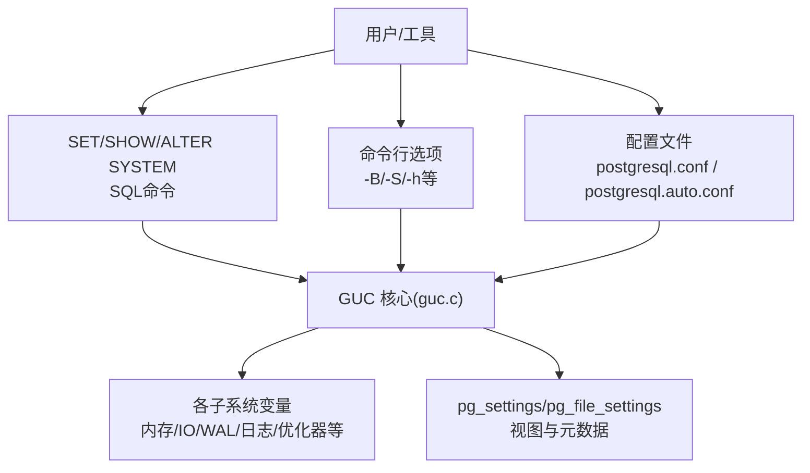
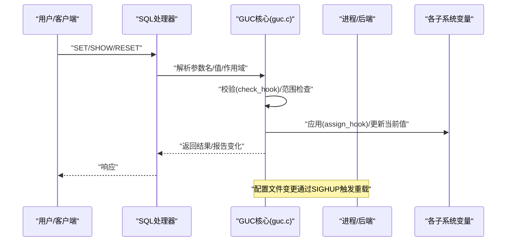
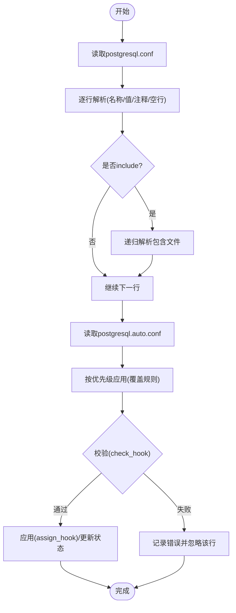
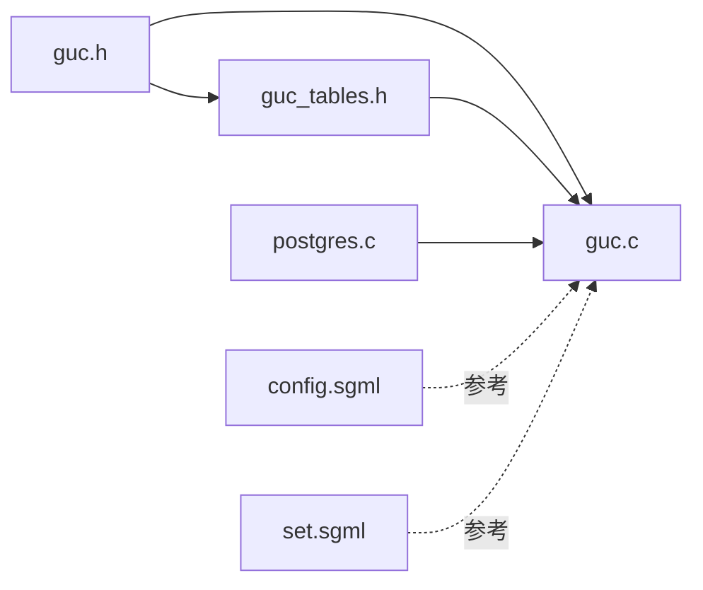

# 配置系统

<cite>
**本文引用的文件**
- [guc.h](file://src/include/utils/guc.h)
- [guc_tables.h](file://src/include/utils/guc_tables.h)
- [guc.c](file://src/backend/utils/misc/guc.c)
- [postgres.c](file://src/backend/tcop/postgres.c)
- [config.sgml](file://doc/src/sgml/config.sgml)
- [set.sgml](file://doc/src/sgml/ref/set.sgml)
- [guc.out](file://src/test/regress/expected/guc.out)
</cite>

## 目录
1. [简介](#简介)
2. [项目结构](#项目结构)
3. [核心组件](#核心组件)
4. [架构总览](#架构总览)
5. [详细组件分析](#详细组件分析)
6. [依赖关系分析](#依赖关系分析)
7. [性能与调优建议](#性能与调优建议)
8. [故障排查指南](#故障排查指南)
9. [结论](#结论)
10. [附录](#附录)

## 简介
本文件面向PostgreSQL（minipg）中的GUC（Grand Unified Configuration，统一配置）参数系统，系统性说明其设计原理、配置文件格式、参数分类与优先级规则、可用参数类别（性能、安全、日志等）、不同部署场景的推荐配置与调优建议，以及配置验证机制与错误处理方法。文档以源码为依据，辅以图示帮助理解。

## 项目结构
GUC系统的核心由头文件定义接口与数据结构，实现文件负责解析、校验、应用与持久化，文档文件提供用户可见的配置说明与示例。关键位置如下：
- 接口与数据结构：src/include/utils/guc.h、src/include/utils/guc_tables.h
- 核心实现：src/backend/utils/misc/guc.c
- 命令行与客户端交互入口：src/backend/tcop/postgres.c
- 用户文档：doc/src/sgml/config.sgml、doc/src/sgml/ref/set.sgml
- 回归测试用例：src/test/regress/expected/guc.out

图表来源
- [guc.c:1-200](file://src/backend/utils/misc/guc.c#L1-L200)
- [guc.h:122-233](file://src/include/utils/guc.h#L122-L233)
- [config.sgml:132-197](file://doc/src/sgml/config.sgml#L132-L197)

章节来源
- [guc.h:21-233](file://src/include/utils/guc.h#L21-L233)
- [guc_tables.h:19-97](file://src/include/utils/guc_tables.h#L19-L97)
- [config.sgml:132-197](file://doc/src/sgml/config.sgml#L132-L197)

## 核心组件
- 上下文与作用域（GucContext/GucSource）
  - 上下文决定“何时可设置”：内部、启动时、SIGHUP重载、后端启动、超级用户/普通用户等。
  - 来源决定“优先级”：默认值、环境变量、配置文件、命令行、全局/库/角色/会话等。
- 变量类型与钩子
  - 支持布尔、整数、实数、字符串、枚举；每种类型提供check/assign/show钩子用于校验、应用与展示。
- 配置项分组
  - 将运行时选项按功能分组（如资源、WAL、查询调优、日志等），便于管理与展示。
- 配置解析与应用
  - 解析postgresql.conf与postgresql.auto.conf，处理include与嵌套，生成ConfigVariable列表并应用。
- 会话/事务级作用域
  - SET/SET LOCAL支持会话或事务级覆盖，使用栈保存先前值并在提交/回滚时恢复。

章节来源
- [guc.h:68-120](file://src/include/utils/guc.h#L68-L120)
- [guc.h:171-233](file://src/include/utils/guc.h#L171-L233)
- [guc_tables.h:19-97](file://src/include/utils/guc_tables.h#L19-L97)
- [guc_tables.h:100-160](file://src/include/utils/guc_tables.h#L100-L160)
- [guc.c:122-200](file://src/backend/utils/misc/guc.c#L122-L200)

## 架构总览
下图展示了从配置源到生效的全链路：

图表来源
- [guc.c:122-200](file://src/backend/utils/misc/guc.c#L122-L200)
- [guc.h:286-394](file://src/include/utils/guc.h#L286-L394)
- [config.sgml:167-184](file://doc/src/sgml/config.sgml#L167-L184)

## 详细组件分析

### 配置来源与优先级
- 来源层次（由低到高，高优先级覆盖低优先级）：
  - 默认值（硬编码/动态默认）
  - 环境变量
  - 配置文件（postgresql.conf）
  - 自动配置文件（postgresql.auto.conf，来自ALTER SYSTEM）
  - 命令行选项
  - 全局/数据库/角色/数据库+角色级别设置
  - 客户端连接请求（启动包）
  - 会话级SET/SET LOCAL
- 同一来源内，后出现的同名参数覆盖前者。
- 某些参数仅能在特定上下文设置（如启动时、SIGHUP重载、超级用户等）。

章节来源
- [guc.h:68-120](file://src/include/utils/guc.h#L68-L120)
- [config.sgml:132-197](file://doc/src/sgml/config.sgml#L132-L197)
- [guc.out:473-582](file://src/test/regress/expected/guc.out#L473-L582)

### 配置文件语法与行为
- 基本语法：每行一个参数，名称=值或名称 值；注释以#开头；空白忽略；单引号包裹复杂值；重复键以最后一个为准。
- 支持include与嵌套包含；auto配置文件与主配置文件同格式，且auto优先。
- 通过SIGHUP重载配置；无效设置会被忽略并记录。

章节来源
- [config.sgml:132-197](file://doc/src/sgml/config.sgml#L132-L197)
- [guc.c:100-120](file://src/backend/utils/misc/guc.c#L100-L120)

### 参数类型与单位
- 类型：布尔、字符串、整数、实数、枚举。
- 带单位的数值：内存单位（B/kB/MB/GB/TB，基数1024）和时间单位（us/ms/s/min/h/d）；带单位时需以字符串形式给出，最终会转换为参数实际单位并可能进行舍入。

章节来源
- [config.sgml:21-128](file://doc/src/sgml/config.sgml#L21-L128)
- [guc.h:218-233](file://src/include/utils/guc.h#L218-L233)

### 作用域与生命周期
- 会话级：SET影响当前会话直至被再次修改或会话结束。
- 事务级：SET LOCAL仅在事务内有效，提交/回滚后恢复为会话级值。
- 堆栈机制：通过栈保存先前的值，确保正确恢复。

章节来源
- [guc_tables.h:100-123](file://src/include/utils/guc_tables.h#L100-L123)
- [set.sgml:92-128](file://doc/src/sgml/ref/set.sgml#L92-L128)

### 校验与应用钩子
- check_hook：对新值进行合法性检查（范围、依赖、平台限制等），失败则返回错误信息。
- assign_hook：在值通过后执行副作用（如调整内核参数、重新初始化子系统）。
- show_hook：自定义显示逻辑。

章节来源
- [guc.h:171-187](file://src/include/utils/guc.h#L171-L187)
- [guc.c:122-200](file://src/backend/utils/misc/guc.c#L122-L200)

### 命令行与客户端注入
- 后端启动时可通过命令行开关设置若干参数（如共享内存、监听地址、端口、SSL等），这些作为高优先级来源。
- 客户端可在连接启动包中传递部分参数，作为会话默认值。

章节来源
- [postgres.c:3746-3871](file://src/backend/tcop/postgres.c#L3746-L3871)

### 配置加载流程（含include与错误）

图表来源
- [guc.c:100-200](file://src/backend/utils/misc/guc.c#L100-L200)
- [config.sgml:132-197](file://doc/src/sgml/config.sgml#L132-L197)

## 依赖关系分析
- guc.c依赖guc.h与guc_tables.h提供的接口与数据结构。
- 各子系统通过DefineCustomXXXVariable注册自身参数，并提供check/assign/show钩子。
- 命令行解析器（postgres.c）在启动阶段调用SetConfigOption注入参数。
- 文档层（config.sgml、set.sgml）描述用户可见的行为与语法。

图表来源
- [guc.h:286-394](file://src/include/utils/guc.h#L286-L394)
- [guc_tables.h:259-276](file://src/include/utils/guc_tables.h#L259-L276)
- [guc.c:1-200](file://src/backend/utils/misc/guc.c#L1-L200)
- [postgres.c:3746-3871](file://src/backend/tcop/postgres.c#L3746-L3871)

章节来源
- [guc.h:286-394](file://src/include/utils/guc.h#L286-L394)
- [guc_tables.h:259-276](file://src/include/utils/guc_tables.h#L259-L276)
- [guc.c:1-200](file://src/backend/utils/misc/guc.c#L1-L200)
- [postgres.c:3746-3871](file://src/backend/tcop/postgres.c#L3746-L3871)

## 性能与调优建议
- 内存与缓冲
  - shared_buffers：根据工作集大小与OS页缓存策略调整，通常占物理内存的合理比例。
  - work_mem：排序/哈希操作内存上限，需结合并发与任务复杂度评估。
  - temp_buffers：会话临时表内存，避免过大导致内存压力。
- I/O与并发
  - effective_io_concurrency/maintenance_io_concurrency：根据存储介质（SSD/HDD）与队列深度调整。
  - checkpoint相关参数：平衡写入放大与崩溃恢复时间。
- WAL与持久化
  - wal_buffers/wal_sync_method：提升WAL吞吐与可靠性。
  - fsync/on/off：生产环境务必开启，开发/测试可酌情关闭但风险显著。
- 查询优化
  - planner相关成本参数与统计目标：依据数据分布与查询模式微调。
- 日志与监控
  - log_min_duration_statement/log_statement_sample_rate：定位慢查询与采样开销。
  - logging_collector与log_destination：集中收集日志以便分析。

提示
- 以上为通用指导，具体数值需基于基准测试与负载特征确定。
- 变更顺序建议：先改不影响重启的参数，再改需重启的参数，逐步观察指标。

[本节为通用指导，不直接分析具体文件]

## 故障排查指南
- 常见错误类型
  - 未知参数名：检查拼写与是否存在该模块。
  - 非法取值：检查范围、单位与类型匹配。
  - 权限不足：某些参数仅超级用户可设。
  - 作用域限制：某些参数只能在启动时或SIGHUP重载时设置。
- 诊断方法
  - 使用SHOW/SELECT pg_settings查看当前值与来源。
  - 使用pg_file_settings预检配置文件变更效果。
  - 关注SIGHUP重载时的日志输出，定位无效设置。
- 典型场景
  - ALTER SYSTEM写入postgresql.auto.conf后未生效：确认已reload或重启。
  - SET LOCAL在事务外无效果：需在事务块中使用。
  - 命令行参数与配置文件冲突：命令行优先级更高。

章节来源
- [guc.out:473-582](file://src/test/regress/expected/guc.out#L473-L582)
- [config.sgml:167-197](file://doc/src/sgml/config.sgml#L167-L197)
- [guc.h:286-394](file://src/include/utils/guc.h#L286-L394)

## 结论
GUC系统通过清晰的上下文与来源分层、严格的校验与应用钩子、灵活的会话/事务作用域，提供了强大而一致的配置管理能力。借助配置文件、SQL命令与命令行选项的多源融合，配合完善的文档与视图，管理员可以高效地调优系统行为并快速定位问题。在生产环境中，应遵循最小变更原则，结合监控与基准测试逐步优化。

[本节为总结性内容，不直接分析具体文件]

## 附录

### 配置参数分类概览
- 文件与路径：数据目录、配置文件、日志路径等。
- 连接与认证：监听地址、端口、SSL、最大连接数等。
- 资源管理：内存、I/O、后台进程、WAL等。
- 查询调优：计划器成本、统计目标、并行度等。
- 日志与审计：日志目的地、级别、采样率、语句/事务采样等。
- 兼容性与客户端：日期/时间格式、语言、字符集等。
- 其他：进程标题、统计采集、自动清理等。

章节来源
- [guc_tables.h:50-97](file://src/include/utils/guc_tables.h#L50-L97)
- [config.sgml:1-300](file://doc/src/sgml/config.sgml#L1-L300)

### 常用命令速查
- 查看当前值：SHOW <参数>; SELECT * FROM pg_settings WHERE name = '<参数>';
- 会话/事务设置：SET/SET LOCAL <参数> = <值>; RESET <参数>;
- 全局默认：ALTER SYSTEM SET <参数> = <值>; SELECT pg_reload_conf();
- 命令行：启动时使用-B/-S/-h/-p等设置相应参数。

章节来源
- [set.sgml:92-128](file://doc/src/sgml/ref/set.sgml#L92-L128)
- [postgres.c:3746-3871](file://src/backend/tcop/postgres.c#L3746-L3871)
- [config.sgml:167-197](file://doc/src/sgml/config.sgml#L167-L197)