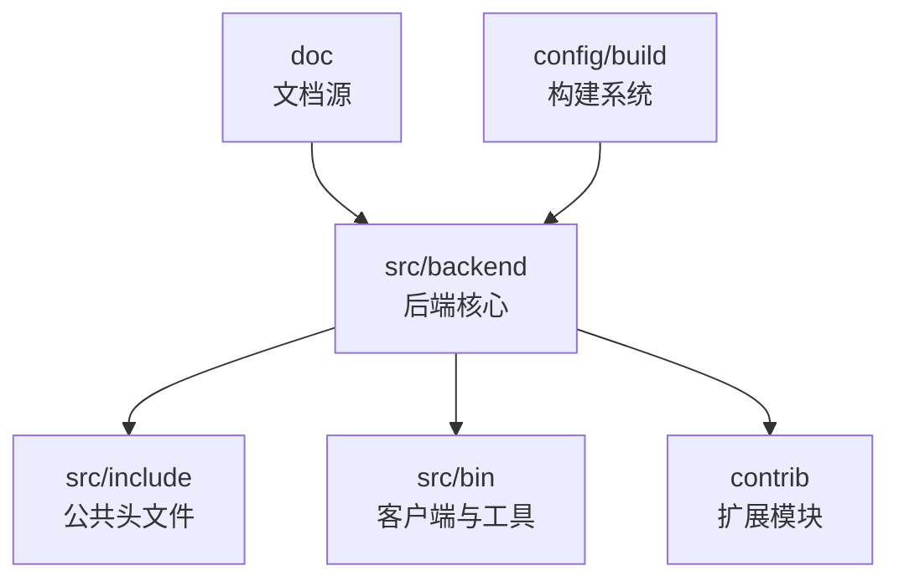
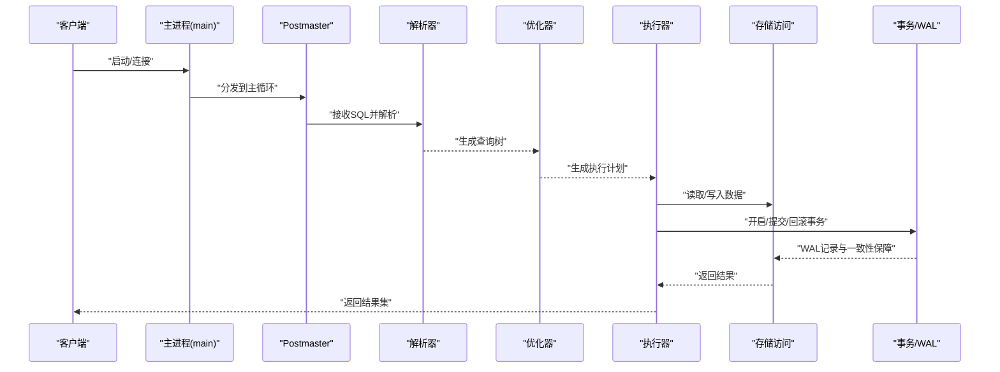
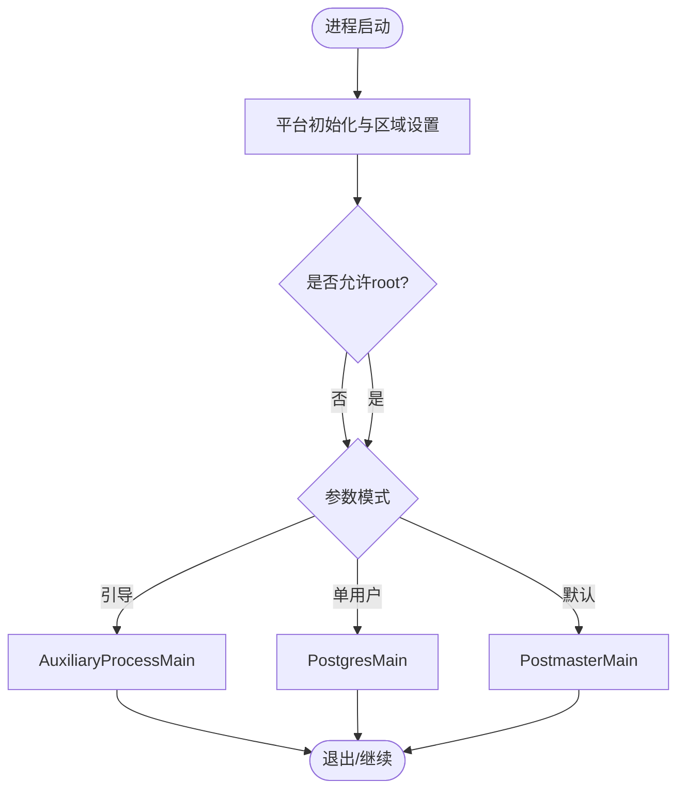
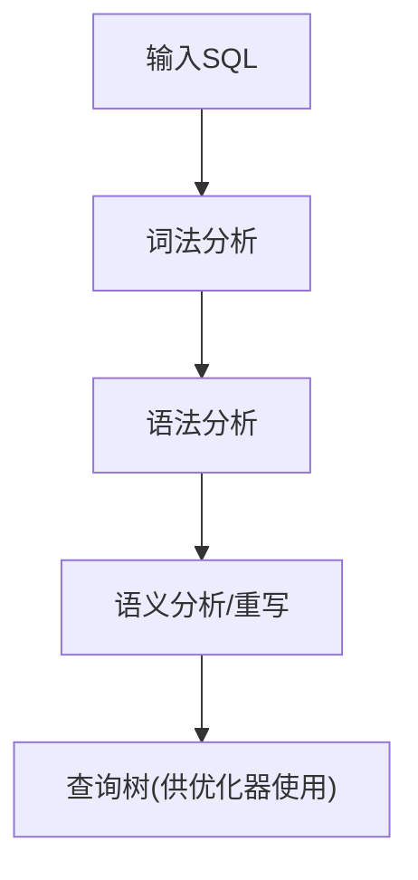
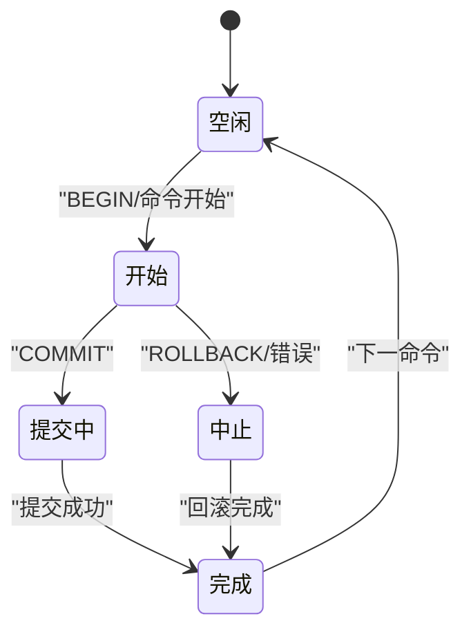
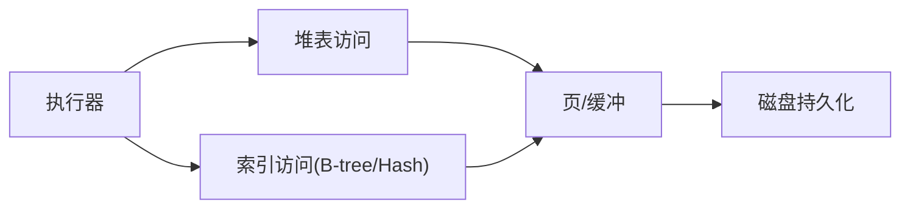
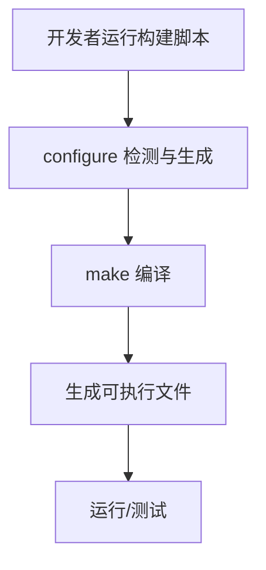
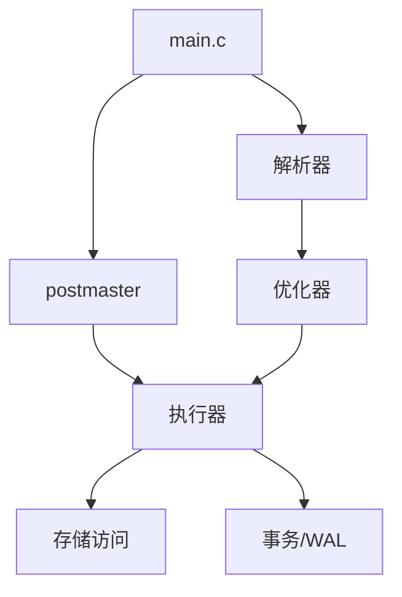

# 项目概述

<cite>
**本文引用的文件**
- [README](file://README)
- [requirement.md](file://mydoc/requirement.md)
- [develop.md](file://mydoc/develop.md)
- [configure.ac](file://configure.ac)
- [build.sh](file://build.sh)
- [main.c](file://src/backend/main/main.c)
- [pg_config.h](file://src/include/pg_config.h)
- [transam/README](file://src/backend/access/transam/README)
- [parser/README](file://src/backend/parser/README)
- [history.sgml](file://doc/src/sgml/history.sgml)
- [intro.sgml](file://doc/src/sgml/intro.sgml)
- [features.sgml](file://doc/src/sgml/features.sgml)
- [bki.sgml](file://doc/src/sgml/bki.sgml)
</cite>

## 目录
1. [简介](#简介)
2. [项目结构](#项目结构)
3. [核心组件](#核心组件)
4. [架构总览](#架构总览)
5. [详细组件分析](#详细组件分析)
6. [依赖关系分析](#依赖关系分析)
7. [性能考量](#性能考量)
8. [故障排查指南](#故障排查指南)
9. [结论](#结论)
10. [附录](#附录)

## 简介
Mini PostgreSQL（简称 minipg）是一个基于 PostgreSQL 的开源学习项目，目标是将原百万行级的源码裁剪至约十万行左右的核心代码，保留数据库内核的关键能力，为数据库内核学习者提供轻量、可理解、可动手的实践环境。项目以 PostgreSQL 14.23 作为初始基线版本，聚焦于“最小可用”的内核路径：启动流程、解析与优化、执行器、存储访问、事务与 WAL、基础工具链等。通过有选择的裁剪与注释化说明，帮助初学者快速建立对复杂数据库系统的整体认知，同时为有经验的开发者提供深入内核细节的可追踪入口。

- 历史背景与动机
  - PostgreSQL 起源于加州大学伯克利分校的 POSTGRES 项目，历经数十年发展成为功能完备的对象关系型数据库。minipg 继承其成熟内核设计，但通过裁剪与聚焦，降低学习门槛。
  - 开发动机在于：让学习者不必在海量代码中迷失，而是围绕“最小必要路径”逐步掌握解析、计划、执行、事务、持久化等关键机制。
- 预期成果
  - 一套可编译、可运行、可调试的最小内核实现；
  - 面向教学与自学的文档与注释；
  - 便于二次扩展的学习型内核平台。

章节来源
- [README:1-6](file://README#L1-L6)
- [requirement.md:1-6](file://mydoc/requirement.md#L1-L6)
- [history.sgml:1-56](file://doc/src/sgml/history.sgml#L1-L56)

## 项目结构
minipg 沿用 PostgreSQL 的经典分层组织方式，按职责划分模块，便于按需裁剪与定位问题：
- src/backend：后端核心逻辑，包括主进程、解析器、优化器、执行器、存储访问、事务/WAL、缓存、工具库等
- src/include：公共头文件与配置宏定义
- src/bin：客户端与运维工具（如 initdb、psql、pg_ctl 等）
- contrib：可选扩展模块（如 amcheck、pageinspect 等），可用于学习与诊断
- doc：官方文档源（SGML），包含历史、特性、安装与维护等
- config/build：构建系统与模板配置

图表来源
- [main.c:46-177](file://src/backend/main/main.c#L46-L177)
- [configure.ac:20-78](file://configure.ac#L20-L78)

章节来源
- [configure.ac:20-78](file://configure.ac#L20-L78)
- [build.sh:1-3](file://build.sh#L1-L3)

## 核心组件
- 启动与进程管理
  - 入口 main() 负责平台初始化、区域设置、权限检查，并根据参数分发到引导模式、单用户模式或 postmaster 主循环。
- SQL 解析与分析
  - 词法分析、语法分析、语义分析与查询重写，生成可优化的查询树。
- 查询优化与计划
  - 基于代价的优化器生成多种执行路径并选择最优计划。
- 执行器
  - 将计划节点转化为实际的扫描、连接、聚合等操作，产出结果元组。
- 存储访问层
  - 堆表、B-tree、Hash 索引、TOAST、可见性映射等，提供数据存取与更新能力。
- 事务与 WAL
  - 三层事务模型（低层事务/子事务、命令级事务、用户可见事务块），配合 WAL 保证持久性与恢复。
- 工具与扩展
  - 常用诊断与辅助工具，便于学习与排障。

章节来源
- [main.c:46-177](file://src/backend/main/main.c#L46-L177)
- [parser/README:1-32](file://src/backend/parser/README#L1-L32)
- [transam/README:1-177](file://src/backend/access/transam/README#L1-L177)

## 架构总览
下图展示了从请求进入、解析、优化、执行到存储与事务的基本链路，体现 minipg 如何保留 PostgreSQL 的核心架构思想。

图表来源
- [main.c:46-177](file://src/backend/main/main.c#L46-L177)
- [parser/README:1-32](file://src/backend/parser/README#L1-L32)
- [transam/README:1-177](file://src/backend/access/transam/README#L1-L177)

## 详细组件分析

### 启动与进程管理（main.c）
- 职责
  - 平台相关初始化、区域设置、权限校验、命令行参数处理；
  - 根据参数选择引导模式、单用户模式或进入 postmaster 主循环。
- 关键点
  - 早期初始化错误与内存管理；
  - 环境变量与本地化设置；
  - 安全策略（非 root 运行）。

图表来源
- [main.c:46-177](file://src/backend/main/main.c#L46-L177)

章节来源
- [main.c:46-177](file://src/backend/main/main.c#L46-L177)

### SQL 解析与分析（parser）
- 职责
  - 词法分析（tokenize）、语法分析（parse tree）、语义分析（analyze）、查询重写（rewrite）；
  - 生成供优化器使用的查询结构。
- 关键点
  - 关键字与语法扩展点；
  - 表达式、函数、类型、排序规则处理；
  - WITH 子句、聚合、操作符等支持。

图表来源
- [parser/README:1-32](file://src/backend/parser/README#L1-L32)

章节来源
- [parser/README:1-32](file://src/backend/parser/README#L1-L32)

### 事务与 WAL（transam）
- 职责
  - 三层事务模型：底层事务/子事务、命令级事务、用户可见事务块；
  - 提交/回滚/保存点、两阶段提交、WAL 记录与恢复。
- 关键点
  - 状态机驱动的事务生命周期；
  - 错误中止与恢复路径；
  - 子事务栈管理与清理。

图表来源
- [transam/README:1-177](file://src/backend/access/transam/README#L1-L177)

章节来源
- [transam/README:1-177](file://src/backend/access/transam/README#L1-L177)

### 存储访问层（access）
- 职责
  - 堆表读写、索引（B-tree、Hash）、TOAST、可见性映射、表采样等；
  - 提供统一的访问接口供执行器调用。
- 关键点
  - 页面级 I/O 与缓冲；
  - 并发控制与可见性判断；
  - 索引插入/搜索/维护。

图表来源
- [transam/README:1-177](file://src/backend/access/transam/README#L1-L177)

章节来源
- [transam/README:1-177](file://src/backend/access/transam/README#L1-L177)

### 构建与配置（configure.ac / build.sh）
- 职责
  - 检测平台与编译器特性，生成 Makefile；
  - 限定 minipg 仅支持 Linux 模板；
  - 提供调试与覆盖率等构建选项。
- 关键点
  - 版本号与包信息；
  - 端口号、线程/原子操作开关；
  - 构建脚本简化重复工作。

图表来源
- [configure.ac:20-78](file://configure.ac#L20-L78)
- [build.sh:1-3](file://build.sh#L1-L3)

章节来源
- [configure.ac:20-78](file://configure.ac#L20-L78)
- [build.sh:1-3](file://build.sh#L1-L3)

## 依赖关系分析
- 内部依赖
  - 主进程依赖解析器、优化器、执行器、存储访问与事务子系统；
  - 解析器依赖关键字表与语法定义；
  - 执行器依赖存储访问与事务；
  - 事务子系统依赖 WAL 与日志记录。
- 外部依赖
  - 操作系统服务（线程、信号、I/O）；
  - 标准库与平台特定实现（port 层）。

图表来源
- [main.c:46-177](file://src/backend/main/main.c#L46-L177)
- [parser/README:1-32](file://src/backend/parser/README#L1-L32)
- [transam/README:1-177](file://src/backend/access/transam/README#L1-L177)

章节来源
- [main.c:46-177](file://src/backend/main/main.c#L46-L177)
- [parser/README:1-32](file://src/backend/parser/README#L1-L32)
- [transam/README:1-177](file://src/backend/access/transam/README#L1-L177)

## 性能考量
- 启动与初始化
  - 尽早初始化错误与内存管理，减少后续开销；
  - 合理设置区域与本地化，避免不必要的转换。
- 解析与优化
  - 利用统计信息与代价模型选择高效计划；
  - 限制不必要的重写与转换。
- 执行与存储
  - 使用合适的索引与扫描策略；
  - 控制 WAL 写入频率与批量提交；
  - 注意锁粒度与可见性判断成本。
- 构建与调试
  - 启用调试符号与覆盖率有助于定位瓶颈；
  - 在生产环境中关闭不必要特性以减少体积与开销。

[本节为通用指导，不直接分析具体文件]

## 故障排查指南
- 启动失败
  - 检查权限（非 root）、端口占用、区域设置；
  - 查看引导模式与单用户模式的输出。
- 解析/优化异常
  - 核对 SQL 语法与关键字；
  - 使用 EXPLAIN 观察计划与代价。
- 事务与 WAL
  - 关注事务状态机与回滚路径；
  - 检查 WAL 归档与恢复配置。
- 构建问题
  - 确认 configure 模板与编译器匹配；
  - 清理后重新配置与编译。

章节来源
- [main.c:46-177](file://src/backend/main/main.c#L46-L177)
- [transam/README:1-177](file://src/backend/access/transam/README#L1-L177)
- [configure.ac:20-78](file://configure.ac#L20-L78)

## 结论
minipg 以 PostgreSQL 14.23 为基础，通过有选择的裁剪与聚焦，保留了数据库内核的关键路径与架构思想，为学习者提供了“小而全”的实践平台。它既适合入门者循序渐进地理解解析、优化、执行、事务与持久化，也适合有经验者深入内核细节进行研究与二次开发。借助清晰的模块化结构与完善的文档，minipg 能够有效降低学习曲线，提升实践效率。

[本节为总结性内容，不直接分析具体文件]

## 附录
- 为什么选择 PostgreSQL 14.23
  - 版本稳定、生态成熟、文档完善；
  - 具备完整的事务、WAL、索引与执行器实现；
  - 便于在不牺牲核心能力的情况下进行裁剪与教学。
- 适用场景
  - 数据库内核课程与实践；
  - 个人学习与研究；
  - 二次开发与实验平台。
- 学习价值
  - 建立对复杂系统的整体认知；
  - 掌握关键算法与数据结构；
  - 培养调试与排错能力。

章节来源
- [requirement.md:1-6](file://mydoc/requirement.md#L1-L6)
- [features.sgml:70-98](file://doc/src/sgml/features.sgml#L70-L98)
- [intro.sgml:84-161](file://doc/src/sgml/intro.sgml#L84-L161)
- [pg_config.h:722-770](file://src/include/pg_config.h#L722-L770)
- [bki.sgml:972-1038](file://doc/src/sgml/bki.sgml#L972-L1038)