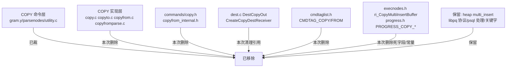

I have comprehensive context from the code-explorer analysis. The COPY command's command layer (syntax, nodes, dispatch) has already been pruned. The remaining work is cleaning up the dead implementation files and references. Let me create the plan.

Based on the thorough analysis, I can now construct the plan. This is a cleanup (dead code removal) task, not a new UI task, so I'll omit the `<design>` tag. I'll use the `code-explorer` subagent where additional verification is needed.

Let me create the plan.

<plan_result>
<req>

## 用户需求

彻底裁剪数据库内核 minipg 中的 COPY 命令（含 COPY FROM 与 COPY TO）。

## 产品概述

minipg 是学习型数据库内核裁剪项目。本任务的 COPY 命令"命令层"（语法层 CopyStmt 生产式、节点层 parsenodes.h 结构、派发层 utility.c T_CopyStmt）已在先前裁剪中移除。本次工作属于"清理死代码"：删除残留的 COPY 核心实现文件及其引用，使全代码库不再存在 COPY 残留。

## 核心功能

- 删除 COPY 核心实现文件（copy.c / copyto.c / copyfrom.c / copyfromparse.c 及对应头文件）
- 清理跨模块依赖（dest.c 的 DestCopyOut/CreateCopyDestReceiver、cmdtaglist.h 的 CMDTAG_COPY/CMDTAG_COPY_FROM）
- 清理死字段与死常量（ResultRelInfo.ri_CopyMultiInsertBuffer、progress.h 的 PROGRESS_COPY_*）
- 清理回归测试孤儿文件与文档引用
- 保留：COPY 客户端协议（libpq PQputCopyData 等）、psql 通用协议处理、heap AM 的 multi_insert 核心表基础设施、COPY/CSV 等多用途关键字
- 回归测试全绿后更新 mydoc/CHANGE.md
</req>

<tech>

## 技术栈

- 项目：minipg（PostgreSQL 内核裁剪学习项目），C 语言后端，GNU make 构建
- 参考：/home/postgres/works/opensource/postgres（裁剪前源码）

## 现状分析（已确认）

COPY 命令的语法层（gram.y 无 CopyStmt 生产式）、节点层（parsenodes.h 无 CopyStmt/CopyFormatOptions）、派发层（utility.c 无 T_CopyStmt、无 DoCopy 调用）均已在先前裁剪中移除。仅残留死代码实现文件与少量引用。删除这些文件不会引发编译错误（唯一跨文件调用为 dest.c 的 CreateCopyDestReceiver）。

## 实施方案

采用"彻底清理死代码"策略：删除全部 COPY 实现文件，同步清理所有跨模块引用、命令标签、死字段、死常量、测试孤儿文件与文档实体，保证 `grep copyto|copyfrom|CopyFrom|CopyTo|DestCopyOut|CMDTAG_COPY|ri_CopyMultiInsertBuffer` 全库 0 命中。

### 边界与保留项（重要）

- **保留 heap AM multi_insert 机制**（tableam.h/tableamapi.c/heapam_handler.c/heapam.c 的 table_multi_insert/heap_multi_insert 及 XLOG_HEAP2_MULTI_INSERT WAL 日志）：属核心表访问基础设施与 WAL 机制，虽当前仅 copyfrom.c 调用，但按"学习价值高暂不裁剪"原则保留。仅删除 COPY 专属的 `ResultRelInfo.ri_CopyMultiInsertBuffer` 缓冲字段（该字段只被 copyfrom.c 与 execMain.c 引用）。
- **保留 libpq COPY 协议 API**（PQputCopyData/PQputCopyEnd/PQgetCopyData、fe-protocol3.c 的 pqGetCopyData3、fe-exec.c 的 getCopyResult）：标准客户端协议接口，独立于后端命令层。
- **保留 psql 通用 COPY 协议处理**（common.c 的 PGRES_COPY_IN/OUT 与 ProcessResult 循环、postgres.c 后端 'd'/'c'/'f' 协议状态机）：通用协议健壮性代码。
- **保留 kwlist.h/gram.y 中 COPY/CSV/BINARY/DELIMITER/QUOTE/ESCAPE/FREEZE/HEADER 等多用途关键字**（作普通标识符），不连带裁剪。

### 实施注意（防回归）

- cmdtaglist.h 删除 CMDTAG 后，需强制重编 tcop/cmdtag.o、tcop/utility.o 等相关目标，并清除 tmp_install 目录中残留的旧 cmdtaglist.h 头副本，防止枚举错位（memory 经验：CMDTAG 枚举错位会导致命令标签错乱）。
- execMain.c 删除 `resultRelInfo->ri_CopyMultiInsertBuffer = NULL` 赋值，需确认该字段仅在 execMain.c 与 copyfrom.c 引用后删除。
- 删除测试文件后，因 copy/copyselect/copydml 已从 parallel_schedule 移除，不影响其它测试 expected；无需改动其它 expected。
- 大裁剪后建议 make clean + 全量重编（避免 .o 混合导致 bootstrap 崩溃）。temp-install 的 rm -rf 会触发 IDE 删除确认，可临时注释 src/Makefile.global 的 temp-install rm 行绕过（跑完还原）。

## 架构设计

本任务为死代码清理，无新增架构。系统内 COPY 相关模块关系：



## 目录结构

```
project-root/src/
├── backend/
│   ├── commands/
│   │   ├── copy.c            # [DELETE] 残留实现，整体删除
│   │   ├── copyto.c          # [DELETE] 残留实现，整体删除
│   │   ├── copyfrom.c        # [DELETE] 残留实现，整体删除
│   │   ├── copyfromparse.c   # [DELETE] 残留实现，整体删除
│   │   └── Makefile          # [MODIFY] 删除 copy.o/copyfrom.o/copyfromparse.o/copyto.o
│   ├── executor/
│   │   └── execMain.c        # [MODIFY] 删除 ri_CopyMultiInsertBuffer=NULL 赋值
│   └── tcop/
│       ├── dest.c            # [MODIFY] 删 copy.h include、DestCopyOut case、CreateCopyDestReceiver 调用
│       └── utility.c         # [MODIFY] 删死 include "commands/copy.h"
├── include/
│   ├── commands/
│   │   ├── copy.h            # [DELETE] COPY API 声明 + CopyFormatOptions
│   │   └── copyfrom_internal.h # [DELETE] CopyFromStateData 等
│   ├── nodes/
│   │   └── execnodes.h       # [MODIFY] 删 ri_CopyMultiInsertBuffer 字段
│   ├── tcop/
│   │   ├── cmdtaglist.h      # [MODIFY] 删 CMDTAG_COPY/CMDTAG_COPY_FROM
│   │   └── dest.h            # [MODIFY] 删 DestCopyOut 枚举值
│   └── commands/
│       └── progress.h        # [MODIFY] 删 PROGRESS_COPY_* 常量
└── test/
    └── regress/
        ├── sql/copy.sql          # [DELETE] 孤儿测试
        ├── input/copy.source     # [DELETE] 孤儿测试
        ├── output/copy.source    # [DELETE] 孤儿测试
        └── expected/copy.out     # [DELETE] 孤儿测试

project-root/doc/src/sgml/ref/
├── copy.sgml         # [DELETE] 整文件删除
└── allfiles.sgml     # [MODIFY] 删 &copyTable; 实体声明
```

</tech>

<extensions>

## Agent 扩展

### SubAgent

- **code-explorer**
- 用途：在裁剪实施前对残留的 COPY 相关 sgml 文档断链（55 个文件 xref 引用）及 psql tab-complete/sql_help 中 COPY 残留做精确定位核对，确保局部删除行号准确、避免误删其他命令（如 drop_if_exists.sql 的 TEXT SEARCH CONFIGURATION (COPY=english) 不属于 COPY 命令）。
- 预期产出：精确的待修改文件清单与行号，供实施步骤直接引用。
</extensions>

<todolist>
<item id="delete-copy-core" deps="">删除 COPY 核心实现与头文件（copy.c/copyto.c/copyfrom.c/copyfromparse.c/copy.h/copyfrom_internal.h）并在 commands/Makefile 移除对应 .o</item>
<item id="clean-dispatch-refs" deps="delete-copy-core">清理派发层引用：dest.c 的 copy.h include/DestCopyOut case/CreateCopyDestReceiver、dest.h 的 DestCopyOut 枚举、utility.c 死 include、cmdtaglist.h 的 CMDTAG_COPY/CMDTAG_COPY_FROM</item>
<item id="clean-dead-field-const" deps="delete-copy-core">清理死字段与常量：execnodes.h 的 ri_CopyMultiInsertBuffer、execMain.c 对应赋值、progress.h 的 PROGRESS_COPY_* 常量</item>
<item id="clean-regress-tests" deps="delete-copy-core">删除回归孤儿测试文件（sql/copy.sql、input/copy.source、output/copy.source、expected/copy.out）并核对 parallel_schedule 无残留引用</item>
<item id="clean-docs" deps="delete-copy-core">使用 code-explorer 核对并删除 doc/src/sgml/ref/copy.sgml、清理 allfiles.sgml 实体及 55 个文件断链 xref</item>
<item id="rebuild-verify" deps="clean-dispatch-refs,clean-dead-field-const,clean-regress-tests,clean-docs">make clean + 全量重编链接 0 error；grep 全库确认 COPY 符号 0 命中；cd src/test/regress make check 全绿</item>
<item id="update-changelog" deps="rebuild-verify">回归测试通过后更新 mydoc/CHANGE.md 记录 COPY 命令（copy from/to）裁剪</item>
</todolist>
</plan_result>